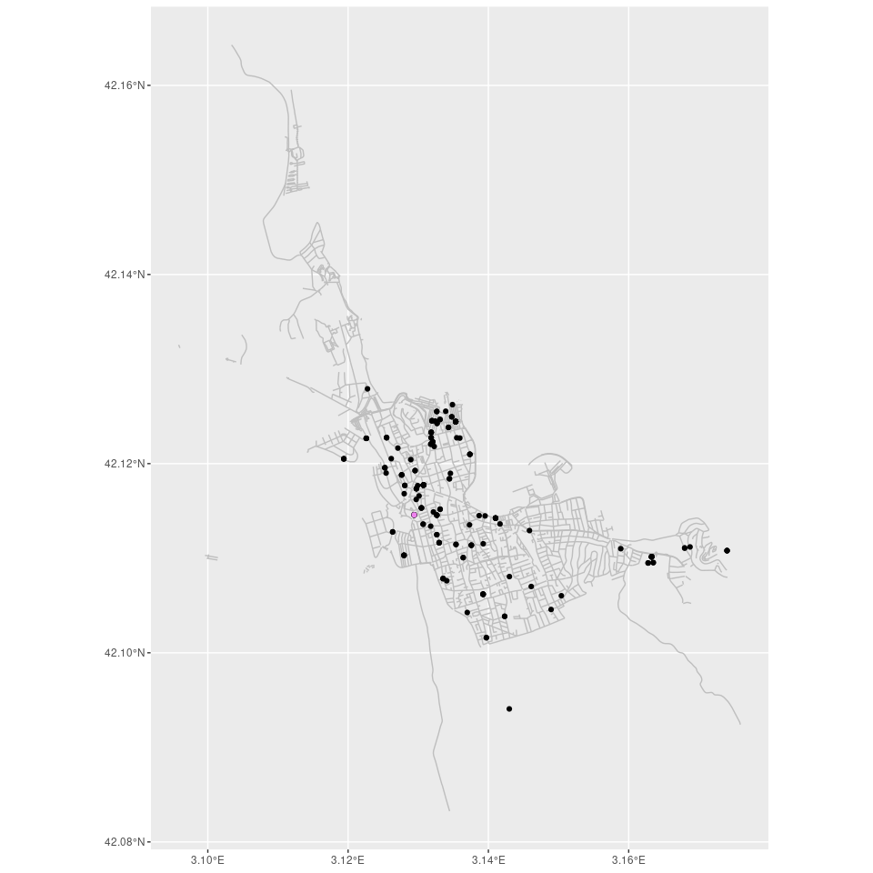
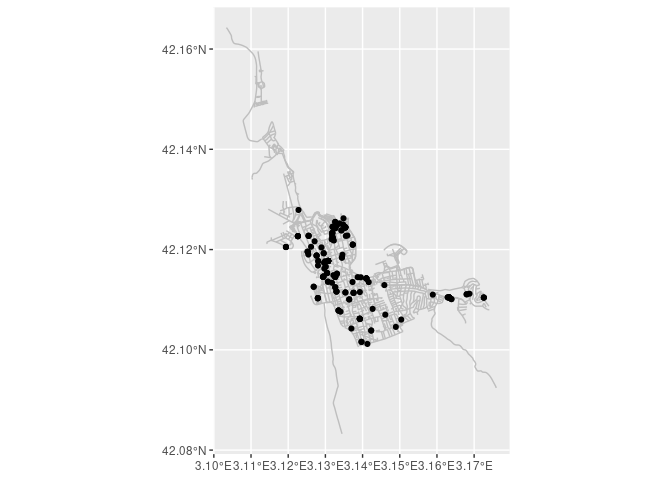
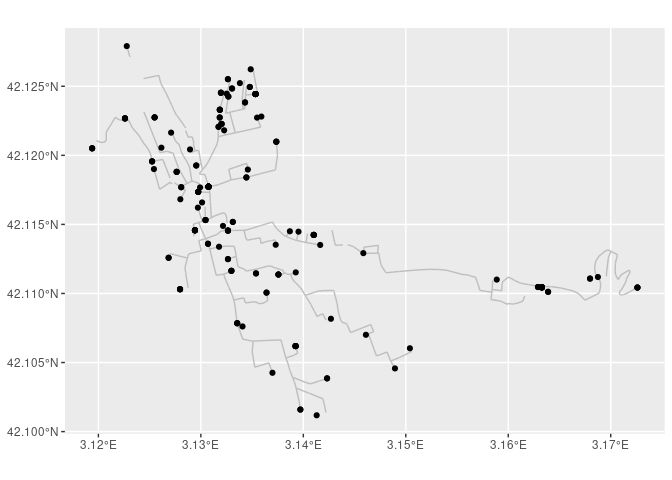

<<<<<<< HEAD
---
title: "School Run l'Esculapi"
author: "Marc Deixt"
date: '2021-06-10'
output: 
  html_document:
    keep_md: true
---


## Adreces
Llegim les adreces del csv


```r
df <- read.csv("Adreces.csv",stringsAsFactors = FALSE)
adresses <- df %>%
  filter(Codi.postal=="17130" && Municipi.de.residència=="L'Escala" ) %>%
 mutate(via = str_replace_all(Tipus.de.via, c("CR"="Carrer","AV" ="Avinguda", "PG"= "Passatge","PL"="Plaça","CM"="Camí") )) %>%
  select(c(Nom.via,Porta,Municipi.de.residència,Codi.postal)) %>%
  mutate(sep_1=",",.before=Municipi.de.residència)%>%
  mutate(sep_2=", Alt Empordà, Girona, ",.after=Municipi.de.residència)%>%
  unite(col="address",sep=" ") 
#AFEGIM la de l'escola

adresses <- adresses %>%
  add_row(address = "Carrer Teranyina 8, L'Escala, 17130")
```


## Geocoding


```r
coordinates <- adresses %>%
  tidygeocoder::geocode(address,timeout= 5)
```


```r
coordinates  <- 
  coordinates %>%
  filter(long>3.1)
  drop_na
```

```
## function (data, ...) 
## {
##     ellipsis::check_dots_unnamed()
##     UseMethod("drop_na")
## }
## <bytecode: 0x55c0adf13888>
## <environment: namespace:tidyr>
```

```r
escola <- coordinates[nrow(coordinates),]
coordinates <- coordinates[1:nrow(coordinates),]
coordinates
```

```
## # A tibble: 177 x 3
##    address                                                      lat  long
##    <chr>                                                      <dbl> <dbl>
##  1 Palafrugell  , L'Escala , Alt Empordà, Girona,  17130       42.1  3.13
##  2 Palafrugell  , L'Escala , Alt Empordà, Girona,  17130       42.1  3.13
##  3 Portbou  , L'Escala , Alt Empordà, Girona,  17130           42.1  3.13
##  4 Closa d'en Llop 2 , L'Escala , Alt Empordà, Girona,  17130  42.1  3.13
##  5 Muntanya Rodona  , L'Escala , Alt Empordà, Girona,  17130   42.1  3.12
##  6 Muntanya Rodona  , L'Escala , Alt Empordà, Girona,  17130   42.1  3.12
##  7 Garbí A , L'Escala , Alt Empordà, Girona,  17130            42.1  3.14
##  8 Llevant  , L'Escala , Alt Empordà, Girona,  17130           42.1  3.13
##  9 Trencabraços  , L'Escala , Alt Empordà, Girona,  17130      42.1  3.17
## 10 Palafrugell  , L'Escala , Alt Empordà, Girona,  17130       42.1  3.13
## # … with 167 more rows
```


```r
icon <- makeIcon(iconUrl="pupil_icon.png",iconWidth = 10,iconHeight = 10)
sc_icon <-  makeIcon(iconUrl="school-icon.png",iconWidth = 35,iconHeight = 35)
m <- leaflet() %>%
  addTiles() %>%  # Add default OpenStreetMap map tiles
  addMarkers(lng=coordinates$long, lat=coordinates$lat, popup=coordinates$address,icon=icon)%>%
  addMarkers(lng=escola$long, lat= escola$lat, icon = sc_icon)
m
```

```{=html}
<div id="htmlwidget-b72492b5edae47dcfa6e" style="width:672px;height:480px;" class="leaflet html-widget"></div>
<script type="application/json" data-for="htmlwidget-b72492b5edae47dcfa6e">{"x":{"options":{"crs":{"crsClass":"L.CRS.EPSG3857","code":null,"proj4def":null,"projectedBounds":null,"options":{}}},"calls":[{"method":"addTiles","args":["//{s}.tile.openstreetmap.org/{z}/{x}/{y}.png",null,null,{"minZoom":0,"maxZoom":18,"tileSize":256,"subdomains":"abc","errorTileUrl":"","tms":false,"noWrap":false,"zoomOffset":0,"zoomReverse":false,"opacity":1,"zIndex":1,"detectRetina":false,"attribution":"&copy; <a href=\"http://openstreetmap.org\">OpenStreetMap<\/a> contributors, <a href=\"http://creativecommons.org/licenses/by-sa/2.0/\">CC-BY-SA<\/a>"}]},{"method":"addMarkers","args":[[42.1078448,42.1078448,42.1153152,42.1205263,42.1205067,42.1205067,42.1227305,42.1189705,42.1111908,42.1078448,42.1113715,42.1113715,42.1114525,42.1145746,42.1114525,42.1116392,42.1144722,42.117733,42.117733,42.117733,42.117733,42.1245309,42.1245309,42.1195616,42.1061902,42.1101496,42.1244365,42.117733,42.1255384,42.110798,42.1095344,42.1061902,42.1223102,42.1223102,42.116589,42.122745,42.122745,42.1045741,42.1216429,42.1103046,42.1262335,42.1061902,42.1173535,42.1173535,42.1244365,42.1244365,42.1173535,42.117733,42.114553,42.117733,42.1162118,42.1038533,42.1038533,42.1279054,42.1148909,42.117733,42.117733,42.1101496,42.1076107,42.117733,42.1244365,42.1244365,42.1080565,42.1249495,42.1244365,42.1190065,42.1226732,42.1244365,42.1223102,42.1188046,42.114553,42.1218122,42.1192633,42.123299,42.123299,42.1176921,42.1226732,42.1226732,42.1173535,42.1124853,42.1124853,42.1153152,42.1153152,42.1145011,42.1145746,42.110061,42.1101496,42.1101496,42.1116392,42.1116392,42.1129194,42.1042572,42.1101496,42.1101496,42.1135969,42.1135969,42.110061,42.114553,42.1015941,42.1015941,42.1103046,42.1103046,42.1209858,42.122741,42.1142395,42.1113715,42.117733,42.124257,42.122741,42.1101496,42.122745,42.123299,42.123299,42.1188046,42.1188046,42.1101496,42.1060324,42.117733,42.1226991,42.114553,42.1205067,42.1142395,42.1238295,42.1094931,42.1238295,42.1176753,42.1094931,42.118399,42.118399,42.1220587,42.1220587,42.1145746,42.1145746,42.1176921,42.125512,42.110798,42.1136216,42.1168198,42.1195616,42.1115251,42.1142395,42.1095344,42.1135259,42.1244365,42.1195616,42.1192633,42.1249495,42.1151803,42.1127809,42.1209858,42.1209858,42.1133818,42.1061902,42.1226732,42.1142395,42.1142395,42.1145746,42.1151803,42.12466325,42.12466325,42.110798,42.1127809,42.1110766,42.1110766,42.125512,42.1245309,42.1204261,42.1244365,42.1244964659938,42.1061902,42.1103046,42.1110038,42.117733,42.124257,42.0940641,42.107008,42.1145746],[3.1335469,3.1335469,3.1304532,3.1261526,3.1193904,3.1193904,3.1354853,3.1345872,3.1687485,3.1335469,3.1375694,3.1375694,3.1353814,3.1294226,3.1353814,3.1329799,3.1395286,3.1307463,3.1307463,3.1307463,3.1307463,3.1319583,3.1319583,3.1252402,3.1392431,3.1632745,3.1353367,3.1307463,3.1339144,3.1740231,3.1635042,3.1392431,3.1320571,3.1320571,3.1301187,3.1254865,3.1254865,3.1489423,3.1270958,3.1279693,3.1348772,3.1392431,3.1297414,3.1297414,3.1353367,3.1353367,3.1297414,3.1307463,3.1326462,3.1307463,3.1297096,3.1423186,3.1423186,3.1227694,3.1321613,3.1307463,3.1307463,3.1632745,3.1340677,3.1307463,3.1353367,3.1353367,3.14299650517588,3.1347798,3.1353367,3.1254226,3.1225956,3.1353367,3.1320571,3.1276375,3.1326462,3.1322731,3.129548,3.1318503,3.1318503,3.1280832,3.1225956,3.1225956,3.1297414,3.1326441,3.1326441,3.1304532,3.1304532,3.1386877,3.1294226,3.1364089,3.1632745,3.1632745,3.1329799,3.1329799,3.1458566,3.136988,3.1632745,3.1632745,3.1306982,3.1306982,3.1364089,3.1326462,3.1397113,3.1397113,3.1279693,3.1279693,3.1373639,3.131841,3.1410184,3.1375694,3.1307463,3.1326844,3.131841,3.1632745,3.1254865,3.1318503,3.1318503,3.1276375,3.1276375,3.1632745,3.1504007,3.1307463,3.13592480427398,3.1326462,3.1193904,3.1410184,3.1343145,3.1627724,3.1343145,3.1299202,3.1627724,3.1344431,3.1344431,3.1317913,3.1317913,3.1294226,3.1294226,3.1280832,3.1326399,3.1740231,3.1416614,3.1279984,3.1252402,3.1392628,3.1410184,3.1635042,3.1373051,3.1353367,3.1252402,3.129548,3.1347798,3.1331201,3.1263496,3.1373639,3.1373639,3.1317743,3.1392431,3.1225956,3.1410184,3.1410184,3.1294226,3.1331201,3.13310220756579,3.13310220756579,3.1740231,3.1263496,3.1679821,3.1679821,3.1326399,3.1319583,3.1289437,3.1353367,3.13242786415392,3.1392431,3.1279693,3.1588775,3.1307463,3.1326844,3.14298254977064,3.1461076,3.1294226],{"iconUrl":{"data":"data:image/png;base64,iVBORw0KGgoAAAANSUhEUgAAADIAAAAyCAYAAAAeP4ixAAAABGdBTUEAALGPC/xhBQAAAYVpQ0NQSUNDIHByb2ZpbGUAACiRfZE9SMNAHMVfW2ulVBTsIKKQoTpZEBVx1CoUoUKoFVp1MLn0Q2jSkKS4OAquBQc/FqsOLs66OrgKguAHiJubk6KLlPi/pNAixoPjfry797h7B/jrZaaaHWOAqllGOpkQsrkVIfSKTgQRRi+GJGbqs6KYguf4uoePr3dxnuV97s/RreRNBvgE4hmmGxbxOvHUpqVz3ieOspKkEJ8Tjxp0QeJHrssuv3EuOuznmVEjk54jjhILxTaW25iVDJV4kjimqBrl+7MuK5y3OKvlKmvek78wkteWl7hOcxBJLGARIgTIqGIDZViI06qRYiJN+wkP/4DjF8klk2sDjBzzqECF5PjB/+B3t2ZhYtxNiiSA4IttfwwDoV2gUbPt72PbbpwAgWfgSmv5K3Vg+pP0WkuLHQE928DFdUuT94DLHaD/SZcMyZECNP2FAvB+Rt+UA/pugfCq21tzH6cPQIa6St0AB4fASJGy1zze3dXe279nmv39ABF2coAkqSXuAAAABmJLR0QA/wD/AP+gvaeTAAAACXBIWXMAAAsTAAALEwEAmpwYAAAAB3RJTUUH5QYFCiECXcXUGgAABdVJREFUaN7tmW9MWlcUwC+iQEH3tE6fFHz8y0N5FVFawYEgoR2hEWe1Wdo1JNZ22ezaZXSdW5qMZXHZYrIPXTK7ZOlMk9m5xTRbdaY1/bBYk3Wt8Q+uaV2tRiZ0pigbgrQCwtsnF3gCM9aV59KTvA/vnnvevb937j3n3PcAeCbkEsrTHvDgwYMyu93e4vV6tbm5uQUul2uKx+NdRRCkraOjY35LvDWj0dgMw/AKAAAnXnw+f16j0ewiPcS+ffsMMAzj8SBWL4FA4LZarTs28nzq0wLJzMy8PD09nZ+sj8fj2RYOh2kOh+MqKb1x8uTJomSeiL5KS0sfbGSMtKcB4nQ6xevtOzk5uYO0IBkZGf719i0sLIyQFkSpVI7m5eWF1tM3KytrmNRRS6fTfb2ePWIymZpIDdLU1JSHIIg9GYRSqfxxo8/ftPBrNBpLGQzGhUgk8o5AIHhRIpEIdTqdfXx83AsAADab7VFjY+MPy8vL5Q8fPuRH27LZbCCRSL7AMOyozWYLp6xEMRgMqps3b17zer2s6Ha5XN47Pz9/xeFwACqVCphMJigpKQmiKOqdmppChUKhYHZ29g6Xy+3t6uqyP8kc0p8UwmKxbO/t7f2eCAEAALm5uekQBEl9Pl8ziqJ/wDDsDQaDy0NDQygMwx9evHjxddKs/aqqqi8SrXmr1SqSyWQ/y2Qyp06nc6y2NzQ03AAA4Pv373+FFBCnTp1C2Gx2MB5EeXn5UkNDwx4AAF5VVTUarcMwzC4Sif7cvXv3nc2ayxPlkbGxsea5ubmMeLpgMDji8XhqAQCAyWTGBJVQKJTHYDAWJiYmsFu3bjFTDuLz+Y4k0tHp9DGXy6UEAIBAIIBH6+7fv8/Mz89fyszMDNNotFBKQSwWi2JkZISdSA9B0HgoFJKt3mIY9ihm4LQ0nMPhDJeXl6cW5Pbt20kPQTKZ7K979+5tAwCA4eFhfk5OzkS03u12s0tLS7s3a49sOPx6PJ6EIBwOZ8Xv9y+t3vv9fgBBUEzOstlsbAiCOCnf7I8fP5Yn0hUUFEzOzMxkE/ZFYWVl5XR02+jo6Ntms/mtlILQaDRBIl0kEhlxOp3bCSB5LBZrgcvl4lHBAnR3d3+m0Wg+PX/+PC0lOUStVr/L5XID8XJIVlaWC8OwMLEdQRC8pqbmRjwbqVT626FDhw6k5HOQxWJJc7vdcrfbvWthYaFsZWVlF5VK3Zmenq5xOBx1TqfzA6KNVCp9xOPxJvr6+tbsMQqFArRa7dHr169fIE3pUltb+3mi0gXDsKW9e/cOsNnsNTqZTNZLqhNiOBxOuObv3r3L8vl8WoVCsUcoFM5E6/h8/q+kOkhptdovkx2i9Ho9DgAAnZ2dTKPRaBGLxVcMBsMnPT09dLKBvJcMpLi4eHIzx/vPlhadTv8OgqCE5QeLxfoGbBWRy+X98bzBYDDwtra2oi0Bcfr06edQFA0mWloajaZrS4BUV1cfSbZHsrOz8bq6OhXpQcrKyn6KnjiHw1mT6SUSyWh7e3saaSFaWloQCIJiJq5Wqy9UVFQMEmGqq6ubSRu1BgcH31hcXIx5NgzDnUVFRW+yWKyV6PbZ2dmPjx07lkM6bxiNxvfpdHrMW0dR9PdVvUKhWFO6qFSqVtJ4pLW19XmlUtnT39//USAQiNEVFxd3RB26rCKRyE0o+8tI4QWz2fwyh8N5EC86VVZWjh0/fpxOCATdIPbnzi8pBTh37hxVr9d3UyiUuCFWLBYPnT17FibaVVRUtBMq3pmUguj1+pcS5QmVSvXtmTNnmAm+TloJZb0/pSBqtboRrP3NvGQymV5NZqfT6V6LtqFQKPilS5dYKdvsCIJc5vP5/ywLlUp1TaVS7ezr6/sqmV0kEpmLvsdxHAwMDLBT6pXDhw9Der3eXFNTo1uvTX19vZLoyfr6+hfAVpMTJ07wiCAlJSUmUp5H/sWLcwiCLBJyzRzYilJXV3cARVE3giBBhULRCp7J/0z+BoPVh3fViLK2AAAAAElFTkSuQmCC","index":0},"iconWidth":10,"iconHeight":10},null,null,{"interactive":true,"draggable":false,"keyboard":true,"title":"","alt":"","zIndexOffset":0,"opacity":1,"riseOnHover":false,"riseOffset":250},["Palafrugell  , L'Escala , Alt Empordà, Girona,  17130","Palafrugell  , L'Escala , Alt Empordà, Girona,  17130","Portbou  , L'Escala , Alt Empordà, Girona,  17130","Closa d'en Llop 2 , L'Escala , Alt Empordà, Girona,  17130","Muntanya Rodona  , L'Escala , Alt Empordà, Girona,  17130","Muntanya Rodona  , L'Escala , Alt Empordà, Girona,  17130","Garbí A , L'Escala , Alt Empordà, Girona,  17130","Llevant  , L'Escala , Alt Empordà, Girona,  17130","Trencabraços  , L'Escala , Alt Empordà, Girona,  17130","Palafrugell  , L'Escala , Alt Empordà, Girona,  17130","Riells de Dalt  , L'Escala , Alt Empordà, Girona,  17130","RIELLS DE DALT  , L'Escala , Alt Empordà, Girona,  17130","Barcelona  , L'Escala , Alt Empordà, Girona,  17130","Teranyina  , L'Escala , Alt Empordà, Girona,  17130","Barcelona  , L'Escala , Alt Empordà, Girona,  17130","Bellcaire  , L'Escala , Alt Empordà, Girona,  17130","Montgó 5a , L'Escala , Alt Empordà, Girona,  17130","Lleida 2a , L'Escala , Alt Empordà, Girona,  17130","Lleida 2a , L'Escala , Alt Empordà, Girona,  17130","Lleida 2a , L'Escala , Alt Empordà, Girona,  17130","Lleida 12 , L'Escala , Alt Empordà, Girona,  17130","DEL PEDRÓ F , L'Escala , Alt Empordà, Girona,  17130","DEL PEDRÓ F , L'Escala , Alt Empordà, Girona,  17130","Puig d'en Llop  , L'Escala , Alt Empordà, Girona,  17130","MALLOLS  , L'Escala , Alt Empordà, Girona,  17130","Figueres B , L'Escala , Alt Empordà, Girona,  17130","del Puig  , L'Escala , Alt Empordà, Girona,  17130","Lleida  , L'Escala , Alt Empordà, Girona,  17130","Maranges  , L'Escala , Alt Empordà, Girona,  17130","Montgó 1 , L'Escala , Alt Empordà, Girona,  17130","Bellcaire 2 , L'Escala , Alt Empordà, Girona,  17130","Mallols  , L'Escala , Alt Empordà, Girona,  17130","Tramuntana 1 , L'Escala , Alt Empordà, Girona,  17130","Tramuntana 1 , L'Escala , Alt Empordà, Girona,  17130","Cadaqués  , L'Escala , Alt Empordà, Girona,  17130","Miró Nord  , L'Escala , Alt Empordà, Girona,  17130","MIRÓ NORD  , L'Escala , Alt Empordà, Girona,  17130","Travessia del Canigó  , L'Escala , Alt Empordà, Girona,  17130","Ribera  , L'Escala , Alt Empordà, Girona,  17130","FITORA  , L'Escala , Alt Empordà, Girona,  17130","DEL PUIG 3 , L'Escala , Alt Empordà, Girona,  17130","Mallols  , L'Escala , Alt Empordà, Girona,  17130","Begur 6 , L'Escala , Alt Empordà, Girona,  17130","Begur  , L'Escala , Alt Empordà, Girona,  17130","Del Puig  , L'Escala , Alt Empordà, Girona,  17130","del Puig  , L'Escala , Alt Empordà, Girona,  17130","Begur  , L'Escala , Alt Empordà, Girona,  17130","Lleida 2 , L'Escala , Alt Empordà, Girona,  17130","Tarragona  , L'Escala , Alt Empordà, Girona,  17130","Lleida  , L'Escala , Alt Empordà, Girona,  17130","Tossa  , L'Escala , Alt Empordà, Girona,  17130","Romaní  , L'Escala , Alt Empordà, Girona,  17130","Romaní  , L'Escala , Alt Empordà, Girona,  17130","Palanca  , L'Escala , Alt Empordà, Girona,  17130","Figueres  , L'Escala , Alt Empordà, Girona,  17130","Lleida 2 , L'Escala , Alt Empordà, Girona,  17130","Lleida 14 , L'Escala , Alt Empordà, Girona,  17130","Figueres 1a , L'Escala , Alt Empordà, Girona,  17130","Lleida 10 , L'Escala , Alt Empordà, Girona,  17130","Lleida 10a , L'Escala , Alt Empordà, Girona,  17130","Puig  , L'Escala , Alt Empordà, Girona,  17130","Puig A , L'Escala , Alt Empordà, Girona,  17130","RIELLS 2 , L'Escala , Alt Empordà, Girona,  17130","Torre  , L'Escala , Alt Empordà, Girona,  17130","Puig  , L'Escala , Alt Empordà, Girona,  17130","Ramader  , L'Escala , Alt Empordà, Girona,  17130","CAMI RAMADER NORD  , L'Escala , Alt Empordà, Girona,  17130","Puig  , L'Escala , Alt Empordà, Girona,  17130","Tramuntana 1 , L'Escala , Alt Empordà, Girona,  17130"," Picasso 1a , L'Escala , Alt Empordà, Girona,  17130","Tarragona  , L'Escala , Alt Empordà, Girona,  17130","Norfeu  , L'Escala , Alt Empordà, Girona,  17130","Goya  , L'Escala , Alt Empordà, Girona,  17130","Enric Serra  , L'Escala , Alt Empordà, Girona,  17130","Enric Serra  , L'Escala , Alt Empordà, Girona,  17130","Greco 5 , L'Escala , Alt Empordà, Girona,  17130","Ramader Nord 3 , L'Escala , Alt Empordà, Girona,  17130","Ramader Nord 3 , L'Escala , Alt Empordà, Girona,  8042","Begur 2 , L'Escala , Alt Empordà, Girona,  17130","Montiró 4a , L'Escala , Alt Empordà, Girona,  17130","MONTIRO 4 , L'Escala , Alt Empordà, Girona,  17130","Torroella de Montgrí 4 , L'Escala , Alt Empordà, Girona,  17130","Torroella de Montgrí  , L'Escala , Alt Empordà, Girona,  17130","Margarida 6 , L'Escala , Alt Empordà, Girona,  17130","TERANYINA 1 , L'Escala , Alt Empordà, Girona,  17130","Santa Coloma  , L'Escala , Alt Empordà, Girona,  17130","Figueres A , L'Escala , Alt Empordà, Girona,  17130","Figueres A , L'Escala , Alt Empordà, Girona,  17130","Bellcaire  , L'Escala , Alt Empordà, Girona,  17130","Bellcaire  , L'Escala , Alt Empordà, Girona,  17130","Cossis 2n , L'Escala , Alt Empordà, Girona,  17130","la Vinya  , L'Escala , Alt Empordà, Girona,  17130","Figueres B , L'Escala , Alt Empordà, Girona,  17130","Figueres A , L'Escala , Alt Empordà, Girona,  17130","l'Estartit  , L'Escala , Alt Empordà, Girona,  17130","L'Estartit 11 , L'Escala , Alt Empordà, Girona,  17130","Sta Coloma  , L'Escala , Alt Empordà, Girona,  17130","Tarragona  , L'Escala , Alt Empordà, Girona,  17130","La Palma  , L'Escala , Alt Empordà, Girona,  17130","La Palma  , L'Escala , Alt Empordà, Girona,  17130","Fitora  , L'Escala , Alt Empordà, Girona,  17130","Fitora  , L'Escala , Alt Empordà, Girona,  17130","Del Puig 3a , L'Escala , Alt Empordà, Girona,  17130","Girona 2a , L'Escala , Alt Empordà, Girona,  17130","Camp Rabassa  , L'Escala , Alt Empordà, Girona,  17130","Riells de Dalt  , L'Escala , Alt Empordà, Girona,  17130","Lleida  , L'Escala , Alt Empordà, Girona,  17130","Santa Màxima 2a , L'Escala , Alt Empordà, Girona,  17130","Girona 8a , L'Escala , Alt Empordà, Girona,  17130","Figueres 7a , L'Escala , Alt Empordà, Girona,  17130","Miró Nord  , L'Escala , Alt Empordà, Girona,  17130","Enric Serra  , L'Escala , Alt Empordà, Girona,  17130","Enric Serra  , L'Escala , Alt Empordà, Girona,  17130","Picasso  , L'Escala , Alt Empordà, Girona,  17130","Picasso  , L'Escala , Alt Empordà, Girona,  17130","FIGUERES 6 , L'Escala , Alt Empordà, Girona,  17130","Daró  , L'Escala , Alt Empordà, Girona,  17130","Lleida 1a , L'Escala , Alt Empordà, Girona,  17130","Margarita  , L'Escala , Alt Empordà, Girona,  17130","Tarragona  , L'Escala , Alt Empordà, Girona,  17130","muntanya rodona  , L'Escala , Alt Empordà, Girona,  17130","Camp Rabassa  , L'Escala , Alt Empordà, Girona,  17130","Horts  , L'Escala , Alt Empordà, Girona,  17130","Ponent 7 , L'Escala , Alt Empordà, Girona,  17130","dels Horts  , L'Escala , Alt Empordà, Girona,  17130","Ponent 5 , L'Escala , Alt Empordà, Girona,  17141","Ponent 5 , L'Escala , Alt Empordà, Girona,  17130","Ponent  , L'Escala , Alt Empordà, Girona,  17130","Ponent  , L'Escala , Alt Empordà, Girona,  17130","Girona 3 , L'Escala , Alt Empordà, Girona,  17130","Girona 3 , L'Escala , Alt Empordà, Girona,  17130","Teranyina  , L'Escala , Alt Empordà, Girona,  17130","Teranyina  , L'Escala , Alt Empordà, Girona,  17130","Greco  , L'Escala , Alt Empordà, Girona,  17130","Joan Massanet  , L'Escala , Alt Empordà, Girona,  17130","Montgó  , L'Escala , Alt Empordà, Girona,  17130","Camp Rabassa 121  , L'Escala , Alt Empordà, Girona,  17130","Rafael  , L'Escala , Alt Empordà, Girona,  17130","Puig del Llop  , L'Escala , Alt Empordà, Girona,  17130","Gladiol  , L'Escala , Alt Empordà, Girona,  17130","CAMP RABASSA  , L'Escala , Alt Empordà, Girona,  17130","Bellcaire 39  , L'Escala , Alt Empordà, Girona,  17130","Palau  , L'Escala , Alt Empordà, Girona,  17130","del Puig  , L'Escala , Alt Empordà, Girona,  17130","Puig d'en Llop 7 , L'Escala , Alt Empordà, Girona,  17130","Goya  , L'Escala , Alt Empordà, Girona,  17130","La Torre  , L'Escala , Alt Empordà, Girona,  17130","la Cellera  , L'Escala , Alt Empordà, Girona,  17130","dels Recs  , L'Escala , Alt Empordà, Girona,  17130","Del Puig 2 , L'Escala , Alt Empordà, Girona,  17130","Del Puig 2a , L'Escala , Alt Empordà, Girona,  17130","Llançà 8 , L'Escala , Alt Empordà, Girona,  17130","Mallols  , L'Escala , Alt Empordà, Girona,  17130","CAMÍ RAMADER NORD 6 , L'Escala , Alt Empordà, Girona,  17130","Camp Rabassa  , L'Escala , Alt Empordà, Girona,  17130","Camp Rabassa  , L'Escala , Alt Empordà, Girona,  17130","Teranyina  , L'Escala , Alt Empordà, Girona,  17130","de la Cellera  , L'Escala , Alt Empordà, Girona,  17130","Sant Pere  , L'Escala , Alt Empordà, Girona,  17130","Sant Pere  , L'Escala , Alt Empordà, Girona,  17130","Montgó  , L'Escala , Alt Empordà, Girona,  17130","Dels Recs  , L'Escala , Alt Empordà, Girona,  17130","Port del Rei  , L'Escala , Alt Empordà, Girona,  17130","Port del Rei  , L'Escala , Alt Empordà, Girona,  17130","PINTOR JOAN MASSANET  , L'Escala , Alt Empordà, Girona,  17130","Riera  , L'Escala , Alt Empordà, Girona,  17130","Muntanya Blanca  , L'Escala , Alt Empordà, Girona,  17130","Puig  , L'Escala , Alt Empordà, Girona,  17130","Girona  , L'Escala , Alt Empordà, Girona,  17130","Mallols  , L'Escala , Alt Empordà, Girona,  17130","Fitora  , L'Escala , Alt Empordà, Girona,  17130","Olives  , L'Escala , Alt Empordà, Girona,  17130","Lleida  3 , L'Escala , Alt Empordà, Girona,  17130","Santa Màxima 1a , L'Escala , Alt Empordà, Girona,  17130","Palau 3  , L'Escala , Alt Empordà, Girona,  17130","Mallols 22 , L'Escala , Alt Empordà, Girona,  17130","Carrer Teranyina 8, L'Escala, 17130"],null,null,null,null,{"interactive":false,"permanent":false,"direction":"auto","opacity":1,"offset":[0,0],"textsize":"10px","textOnly":false,"className":"","sticky":true},null]},{"method":"addMarkers","args":[42.1145746,3.1294226,{"iconUrl":{"data":"data:image/png;base64,iVBORw0KGgoAAAANSUhEUgAAAOEAAADhCAYAAAA+s9J6AAAABGdBTUEAALGPC/xhBQAAAYVpQ0NQSUNDIHByb2ZpbGUAACiRfZE9SMNAHMVfW2ulVBTsIKKQoTpZEBVx1CoUoUKoFVp1MLn0Q2jSkKS4OAquBQc/FqsOLs66OrgKguAHiJubk6KLlPi/pNAixoPjfry797h7B/jrZaaaHWOAqllGOpkQsrkVIfSKTgQRRi+GJGbqs6KYguf4uoePr3dxnuV97s/RreRNBvgE4hmmGxbxOvHUpqVz3ieOspKkEJ8Tjxp0QeJHrssuv3EuOuznmVEjk54jjhILxTaW25iVDJV4kjimqBrl+7MuK5y3OKvlKmvek78wkteWl7hOcxBJLGARIgTIqGIDZViI06qRYiJN+wkP/4DjF8klk2sDjBzzqECF5PjB/+B3t2ZhYtxNiiSA4IttfwwDoV2gUbPt72PbbpwAgWfgSmv5K3Vg+pP0WkuLHQE928DFdUuT94DLHaD/SZcMyZECNP2FAvB+Rt+UA/pugfCq21tzH6cPQIa6St0AB4fASJGy1zze3dXe279nmv39ABF2coAkqSXuAAAABmJLR0QA/wD/AP+gvaeTAAAACXBIWXMAAAsTAAALEwEAmpwYAAAAB3RJTUUH5QYFCicA5ZESsAAADe9JREFUeNrt3X9sFOedx/HPzP7wrm0wYBsMhABxCGBMKDRtyAWkJuoRpZFOSnLuFSvKFRX1n7bWXftP1KTStYqqVGruJE5NdVFOqOhkevh6Vf+4okOooTIcARGoww/zowQbiLG9dmID3t87c38sJqTY8a+Z3Zn1+/VXZDY7u8/zfPb5zs7O80gAAAAAAAAAAAAAAAAAAAAAAAAAAAAAAAAAAAAAAAAAAABAKTFoAn+68OFV+41ftOr9c1f0xYaVeuU7zVr90IP0JyFEoQK4+qG/lx6tkYKmlLWkDwZ04cNfEUQfCtAE/nO61/in7kBW0ZCpkCGFAoaytVGd7uhU99mjP6aF/CVIE/jPHzuv5WfAe0RDpv546SMd64rbbh67piKg+toyZltCiOg4MfiH/QOuHvebjRU0PiHE5wWzKswk5TcmTQAQQoAQAiCEACEEQAgBQgiAEAKEEAAhBAghAEIIEEIAhBAghAAIIUAIARBCeMRw2qYRXMDyFiUkYUub6spcPcaiuQwZQojxZS399LmFLDJDOQqAEAKEEAAhBAghAEIIEEIAE+E6oU8lMpaUDEkhW8oYUiRDoxBCFMwnQb2wdVDf+1qnVlZf05XBZfrX36/Vf7dX0zaA27Kp2L7f/LLO7j0ku/eQ7KsHdfe/f/PLOjubiu2jlfyFnzj5yPCVd+zhyzsVDkrp7P3/Pvr3qvp3VLVyJ31LCOHY+d/ge3bs1GZZGckMTfz40cfVbnxP0erN9LHH8e2ox0vPvhPNdt/xzfnOCk2yU+88ru/4ZvWdaKZEZSbEdHxy8U17+PIPJh28iWbGqvo3Nf+RH9DfhBATGek9YA+e2Tbp0nMqQTRDUnXjAVXUbaPfCSH+UiZx1f747CtKxFodDd9YYYzWNmvBujcUij5I/xNCSNLHna/bN7teczV8Y4Vx7orXtWDta4wBQkjp6XTpSYlKCDGJ0jN2qlnp4cNFCd9YYQxXbVHtxlZKVEJI6VnsMFKiEsKSdetam/3JhSbfvN75q9s0Z1kT44MQ+l/q5jl78My3PVN6TrVErW58W2VzGxgnLuIXMy7JpmL7Yh0t9o0jDcrG/RVAKf+FTTZ+WDeONCjW0cKvbpgJ/eVm9x576NLLJfe+5q3ao7nLX2bMEELvSgy+Zw+e/ZayI2d9N/NNtkQNVqxT9bp/54fhlKPeKz37T+6w+45vlpUuzQCOlqhW+qz6jm9W/8kdlKjMhN4wfOUd+5PzO0s2eBPNjPPXcO8iISxi6TmVe/xKOYjcu0g5WvDSczr3+JXsAOLeRWbCQnLyHr9Snhm5d5EQEkCCSAhLUdd+2QRwakFc8Szji3NCh2QSV9knmnZzDYv/+nCGufsJGpr47yCEcCh4Zkgqm9es8kXPK1Lz+Jj3/WUSV+3kwDHF+36r1FDrrL98QgjhWACr6t/UnOUvtwXLar8utY772HuDmU3F9t3q3tPEl0nex4nzJM9tPjr0YMHXgClftEMLN+2ecR/1n9xhx/t2F/z1L/3KVe7UnwS+mPHo7LegYY8jAZSkhZt2Gwsa9nzmvBGEEJ8TwNqNBxy/ZWju8peN2o0HCCIhxEQBrG5sc23ls4q6bUZ1YxtBJIQYNyRLWlxf12XOsiajYkkLjU0IMZbaDbuMUjoOCKGvytD5q9sKesz5qylLCSE+7YSQCr684JxlTQbXDwkh7qhc+vqsOi4IoedK0YqlLxTl2BVLX6AkJYSQVLTFdVnUlxBC+SUEZ/PxQQiLLlz55Vl9fBDCSckODrj23EZgTlHfm5vHd7PdSqoaognul/zzJTt5+c9KdpxU8sQJ9f/shzJflJR1/lh27lZR36tbxzejUv/Pfqiurz9vRx57TJENmxSpf1iRh1dxHkoI7zfSccpOnjuj5J9OKt15Rj3f2ykjUi4jHJZkyoxWyq11GmwrVdwQunh8M1qpnHJKvn9ciaOHZSfjuvI3f22H1zYq8oVNijQ0qmLDxlkfylnXAOmej+xUd5eSpzsUP9oua7RkCgTvhE6SeU+VnpMCKwKyv/ZfrsyEkvTgV4vXD1cPuvT5EpSM3/+tcl05KXDP3y0rH/50WsrlG9SsrlH5E1sVWb9BZctXKLxkqUEISyx08dMfKNlxUqnOM8r19sgIhT8NnTnBabHLIbQy0gNPx+7cNV/gc91UbN/1P9Q2ufLLmfFCOGYjWHdDaWfSCtQtUdnaRkU2bFL5+kdLPpQl9+bulpZnTyv1/rH8mwyFZUTL75/lJqMAIaxuLM6uuLeutdmDZ5pU9BCOEUpJshNx2Zm0JKnsi48rsm59SZawvn8zt44esZOnO5S+fEnpi+fzJc5kZzkPhFCSguVbtOSvDhe8L3r+b4udjR927duGaYdwgtlSgaDCj6xRuH6VIus3aM4TTxqEsIClZfLiBaUunlf8aPv9peV0ZjoPhNDKSIufPFfQX7Ckbp6zbxxpcG/dGadDqPHPK0dL2PIntqrskTWKPLLaVyWsp1/o6KWCkfZ3lbl8SdbQx1M7n/NJCKX8coaLHmstWH/0nWi2U0Ot7h3AzRBO4rzSnLdAofpVqtj6lOcvjXjqhd17qSD1wcn8C7x7qUCFCV2RQji6toxbS1t8pp17D9ixU9vcXX2t0CH8nNnSTsbzH3SPbvLkpZGivZAJLxWYHvkxT4FCOGrJVne/Kc2mYvt62mubXH8jxQ7hROeV8s6lEaOQoZvRpYJZEkLJ3euGrl0X9EMIJyhhi3VpxNWDDP3vfnuk/V2lPzj16R+9HjoPhNAMr1Pd44ccnRGzqdi+3mNfabLSZ0UIJzdTSlL40Y2q2PqU5j3zrOG7EHbv2G5bgwPTvz43i0M4yqktqEe39i4oP4ZwvPPKRFxmdY2W797rSl5cSUbs7bdsa2hIRkVlPnwmN2tMR9/xzYp1tEx7C+psKrYv1tFyd2tvTDUd+bFrVFTKGhpS7O23XCnlXfkBd/xo+6ffaGL6YyAkJWK7NNKzqynW0WJXPtA8qZkxMfiefft6q67/oVZmiJ2ZHCkZw2HFj7bLNyGEa2FU137Z0dpmhSoaFIjUyQxWycoOK5fsVWbknFJDreo7vpnw+Qgh9FkYJSk11KrU0PgbgxI+QogChxI+70eaACCEACEEQAgBQgiAEAKEEEDhefc6oWUpEjSVzFrTfoq7/z+/XfWvWTAOPBnCiCm1jwT1b4OmTqWn/8P1jWFbryzMqbHcVtJiPPtNxJTOJAN643qgpMeB90JoWXr3dlDbu00pOLNProMJQwcvS20rLH0pmmVG9NkM2D4SVFOXc+Ng73JLT821PBdET86E3+0NSEFDUQfu3koETf2839Dv6i1mQz/NgkFTP+93dhx8t9fQ++Xe+zD23NRwW6YGc840vCRFDelY2iCAPpO08v3m5DgYzBm67cHvIqnPAEIIEEIAhBAghAAIIUAIARBCgBACKDBWW/OYcAF6JJ2lnQkhxvWrd7+stmOLFIs7X6TUlltqerxP27cep6EJIcaaAb/xL8/pUGeVFMm4cozuIenE3oe1/0+1+vU//g8zIiHEvQE80lmnQ51Vis7JuXuqHsrpUGeVjnTW6cm1vQTRA/hixiMuXFslhQqzf6dCdv54IIRjqTTzt50kHBqPCVuqDtiK8HHjKxEz329OjoOokR9fhHASjf9qdU7KOnQDYNbST2pyjGof+kmNs+Pg1eqcJz+MPXdOmLSknbU5SQG91jvDDgia+sVSSy8u4K56v0la0osL8p32nT5zxmF8vc7Wztoca8xMNYgvVUs3ZvBF4eJQfmYlgP4O4nPz0iU9DoJe7gBJWhyYScuZBLAEgljq48D7lyhYIQ0lPg4Y4QAhBAghAEIIEEIAhBAghAAIIUAIARBCYHbx/HbZM8V22T43C8aBZ7fLvpIxtbc/qHPp6T9PQ1j69sKsKi2C6NcA3papf+6Z+TjYXp3VyqC4lWmyDX8mGdBXLwcc2CZZ2jUc1tGH0losgui3AN7ImXriw/CMn+pgQto1GNTB+pweDuc8Nw48F8JI0NSr3UHntkm2pR/dCOo/VmS5rclHIkFTP7qeH55ObZf96g1Dv6u3PTcOPDc1DGSd3yb5YIL7Cv0maeX7zelt0wc8uLoc9RlACAFCCIAQAoQQACEECCEAQggQQgCEECCEAAghQAgBEEKAEBaF09sZj26TzHbZ/hJxeNt0t8ZXSYYwYkotVZZzjX9nm2T4j5Pbpifs/Lhiu+xJSFrS9+uy6s8G9ethzWyJi6yllmrppfkZJa2Zt37YxdYKhFL5wZLNFKCVy+4ez633lHZgHLw0P6P+TFi7Bq0Zj4NvVOXHlRdv7jbceNLuHdttOx6f0VoeEVO6kpKup6f/HA+ELa0sm+HiPpal2zVVOrx4jasdcW0goJ6hwn1ML5lnaVmNuxXClhvnVTkwXDLjwCgv1/Ldex3PjKe3y14csLQ4as3weZwZ2BevrXf9PddEC1c2JxIBXbzm7jG2BM+X3DiYFeXoZ89YvdVwAbN0zi3dfi85K1Cy48DxYc7pP0AIAUIIgBAChBAAIQQIIQBCCBBCJwQX1tGyKDlujWtXQljx9DZZN4foNZQM6+aQKp7e5k643XjSec88a8Tefsu+9dv/lBEKl0AXVCmTSivDWJyCnBSU7ETc9+/EzqQ15/m/07xnnnXlhgfDzRef7vnITnV3+b9mLy/X+bhBrqZoTbktK+7/EJYtX6HwkqUMAAAAAAAAAAAAAAAAAAAAAAAAAAAAAAAAAAAAAAAAAAAAAGBS/h+hdqjaLN93eQAAAABJRU5ErkJggg==","index":0},"iconWidth":35,"iconHeight":35},null,null,{"interactive":true,"draggable":false,"keyboard":true,"title":"","alt":"","zIndexOffset":0,"opacity":1,"riseOnHover":false,"riseOffset":250},null,null,null,null,null,{"interactive":false,"permanent":false,"direction":"auto","opacity":1,"offset":[0,0],"textsize":"10px","textOnly":false,"className":"","sticky":true},null]}],"limits":{"lat":[42.0940641,42.1279054],"lng":[3.1193904,3.1740231]}},"evals":[],"jsHooks":[]}</script>
```


Convert points to to SF object

```r
# Convert data frame to sf object
alumnes_sf <-  st_as_sf(x = coordinates, 
                        coords = c("long", "lat"),
                        crs = "+proj=longlat +datum=WGS84 +ellps=WGS84 +towgs84=0,0,0")

escola_sf <- st_as_sf(x = escola, 
                        coords = c("long", "lat"),
                        crs = "+proj=longlat +datum=WGS84 +ellps=WGS84 +towgs84=0,0,0")
```


```r
escola_sf[1,"address"] <- "ESCOLA"
alumnes_i_escola <- rbind(alumnes_sf,escola_sf)
```


### Maybe explore the graph way. Download ways and points,nodes and vertices and find shortest path.


```r
available_tags("highway")
```

```
##  [1] "bridleway"              "bus_guideway"           "bus_stop"              
##  [4] "busway"                 "construction"           "corridor"              
##  [7] "crossing"               "cycleway"               "elevator"              
## [10] "emergency_access_point" "emergency_bay"          "escape"                
## [13] "footway"                "give_way"               "living_street"         
## [16] "milestone"              "mini_roundabout"        "motorway"              
## [19] "motorway_junction"      "motorway_link"          "passing_place"         
## [22] "path"                   "pedestrian"             "platform"              
## [25] "primary"                "primary_link"           "proposed"              
## [28] "raceway"                "residential"            "rest_area"             
## [31] "road"                   "secondary"              "secondary_link"        
## [34] "service"                "services"               "speed_camera"          
## [37] "steps"                  "stop"                   "street_lamp"           
## [40] "tertiary"               "tertiary_link"          "toll_gantry"           
## [43] "track"                  "traffic_mirror"         "traffic_signals"       
## [46] "trailhead"              "trunk"                  "trunk_link"            
## [49] "turning_circle"         "turning_loop"           "unclassified"
```


```r
#building the query
carrers_lescala <- getbb("L'Escala") %>%
       opq()  %>%
       add_osm_feature(key="highway",value = c("residential", "living_street",
                            "unclassified",
                            "service", "footway", "cycleway"
                  )) %>% #maybe filter and get only small streets?
  osmdata_sf()
```


```r
library(ggplot2)
ggplot() +
  geom_sf(data = carrers_lescala$osm_lines,
          inherit.aes = FALSE,
          color = "gray") +
  geom_sf(data = alumnes_sf,inherit.aes = FALSE)+
  geom_sf(data = escola_sf,inherit.aes = FALSE,color="violet")
```

<!-- -->

Transform or convert coordinates of simple feature


```r
carrers_sf <- carrers_lescala$osm_lines %>%
  st_transform(crs = "+proj=longlat +datum=WGS84 +ellps=WGS84 +towgs84=0,0,0") 
```


```r
# Create a matrix of touching streets
touching_streets <- st_touches(carrers_sf, sparse = FALSE)
```

```
## although coordinates are longitude/latitude, st_touches assumes that they are planar
```

Flipo que faci servir hclust per això. Mira-t'ho bé.


```r
# Merge all streets that touch each other converting all
highways_hclust <- hclust(as.dist(!touching_streets), method = "single")
# Cut the dendrogram at heigh 0.5 so that all touching 
  # streets stay in the same group
  highways_groups <- cutree(highways_hclust, h = 0.5)
```


```r
table(highways_groups)
```

```
## highways_groups
##    1    2    3    4    5    6    7    8    9   10   11   12   13   14   15   16 
## 1233    5    1    1    2    3   12    1    1    1   14    1    1    1    1    1 
##   17   18   19   20   21   22   23   24   25   26   27   28   29   30   31   32 
##    3    7    1    1    1    1    1    1    1    1    1    1    1    1    1    1 
##   33   34   35   36   37   38   39   40   41   42   43   44   45   46   47   48 
##    1    1    2    1    1    1    1    1    1    1    1    1    1    2    1    1 
##   49   50   51   52   53   54   55   56   57   58   59   60   61   62   63   64 
##    4    1    1    1    1    1    1    1    1    1    2    1    1    2    1    1 
##   65   66   67   68   69   70   71   72   73   74   75   76   77   78   79   80 
##    2    1    1    1    1    1    2    1    1    1    1    1    1    1    2    1 
##   81 
##    1
```


```r
carrers_sf <- carrers_sf[highways_groups == 1, ]
```


```r
#library(purrr)
nearest_point <- alumnes_i_escola %>%
  mutate(
    index_of_nearest_feature = st_nearest_feature(., carrers_sf),
    nearest_feature = st_geometry(carrers_sf[index_of_nearest_feature,]),
    nearest_point = purrr::pmap(
      list(geometry, nearest_feature),
      ~ st_nearest_points(.x, .y) %>% st_cast("POINT") %>% magrittr::extract2(2)
    )
  ) %>%
  pull(nearest_point) %>%
  st_sfc(crs = "+proj=longlat +datum=WGS84 +ellps=WGS84 +towgs84=0,0,0") 
```

```
## although coordinates are longitude/latitude, st_nearest_points assumes that they are planar
```

```r
nearest_point
```

```
## Geometry set for 178 features 
## Geometry type: POINT
## Dimension:     XY
## Bounding box:  xmin: 3.11939 ymin: 42.10118 xmax: 3.172606 ymax: 42.12791
## CRS:           +proj=longlat +datum=WGS84 +ellps=WGS84 +towgs84=0,0,0
## First 5 geometries:
```

```
## POINT (3.133547 42.10784)
```

```
## POINT (3.133547 42.10784)
```

```
## POINT (3.130453 42.11532)
```

```
## POINT (3.126149 42.12055)
```

```
## POINT (3.11939 42.12051)
```


```r
alumnes_i_escola_nearest_points <- alumnes_i_escola %>% 
  st_drop_geometry() %>% 
  st_as_sf(., geometry = nearest_point)
alumnes_i_escola_nearest_points
```

```
## Simple feature collection with 178 features and 1 field
## Geometry type: POINT
## Dimension:     XY
## Bounding box:  xmin: 3.11939 ymin: 42.10118 xmax: 3.172606 ymax: 42.12791
## CRS:           +proj=longlat +datum=WGS84 +ellps=WGS84 +towgs84=0,0,0
## First 10 features:
##                                                       address
## 1       Palafrugell  , L'Escala , Alt Empordà, Girona,  17130
## 2       Palafrugell  , L'Escala , Alt Empordà, Girona,  17130
## 3           Portbou  , L'Escala , Alt Empordà, Girona,  17130
## 4  Closa d'en Llop 2 , L'Escala , Alt Empordà, Girona,  17130
## 5   Muntanya Rodona  , L'Escala , Alt Empordà, Girona,  17130
## 6   Muntanya Rodona  , L'Escala , Alt Empordà, Girona,  17130
## 7            Garbí A , L'Escala , Alt Empordà, Girona,  17130
## 8           Llevant  , L'Escala , Alt Empordà, Girona,  17130
## 9      Trencabraços  , L'Escala , Alt Empordà, Girona,  17130
## 10      Palafrugell  , L'Escala , Alt Empordà, Girona,  17130
##                     geometry
## 1  POINT (3.133547 42.10784)
## 2  POINT (3.133547 42.10784)
## 3  POINT (3.130453 42.11532)
## 4  POINT (3.126149 42.12055)
## 5   POINT (3.11939 42.12051)
## 6   POINT (3.11939 42.12051)
## 7  POINT (3.135485 42.12273)
## 8  POINT (3.134587 42.11897)
## 9  POINT (3.168748 42.11119)
## 10 POINT (3.133547 42.10784)
```


```r
library(ggplot2)
ggplot() +
  geom_sf(data = carrers_sf$geom,
          inherit.aes = FALSE,
          color = "gray") +
  geom_sf(data = alumnes_i_escola_nearest_points,inherit.aes = FALSE)
```

<!-- -->


```r
carrers_sf <-carrers_sf[,"name"]
rnet <- SpatialLinesNetwork(rnet_breakup_vertices(rnet = carrers_sf))
```


```r
nodes_origen <- stplanr::find_network_nodes(sln = rnet, x = coordinates$long, y = coordinates$lat)

node_desti <- stplanr::find_network_nodes(sln = rnet, x = escola$long, y = escola$lat)
```


```r
od_data = data.frame(start = nodes_origen, end = node_desti)
```


```r
rutes = sum_network_links(sln = rnet, routedata = od_data)
rutes <- drop_na(rutes)

ggplot() +
  geom_sf(data = rutes$geometry,
          inherit.aes = FALSE,
          color = "gray") +
  geom_sf(data = alumnes_i_escola_nearest_points,inherit.aes = FALSE)
```

<!-- -->


```r
m <- leaflet() %>%
  addTiles() %>%  # Add default OpenStreetMap map tiles
  addPolygons(data=rutes$geometry) %>%
  addMarkers(data = alumnes_i_escola_nearest_points, icon = icon) %>%
  addMarkers(lng=escola$long, lat= escola$lat, icon = sc_icon)
```

```
## Warning: sf layer has inconsistent datum (+proj=longlat +ellps=WGS84 +towgs84=0,0,0,0,0,0,0 +no_defs).
## Need '+proj=longlat +datum=WGS84'

## Warning: sf layer has inconsistent datum (+proj=longlat +ellps=WGS84 +towgs84=0,0,0,0,0,0,0 +no_defs).
## Need '+proj=longlat +datum=WGS84'
```

```r
m
```

```{=html}
<div id="htmlwidget-c2b39efaffca8ee29cde" style="width:672px;height:480px;" class="leaflet html-widget"></div>
<script type="application/json" data-for="htmlwidget-c2b39efaffca8ee29cde">{"x":{"options":{"crs":{"crsClass":"L.CRS.EPSG3857","code":null,"proj4def":null,"projectedBounds":null,"options":{}}},"calls":[{"method":"addTiles","args":["//{s}.tile.openstreetmap.org/{z}/{x}/{y}.png",null,null,{"minZoom":0,"maxZoom":18,"tileSize":256,"subdomains":"abc","errorTileUrl":"","tms":false,"noWrap":false,"zoomOffset":0,"zoomReverse":false,"opacity":1,"zIndex":1,"detectRetina":false,"attribution":"&copy; <a href=\"http://openstreetmap.org\">OpenStreetMap<\/a> contributors, <a href=\"http://creativecommons.org/licenses/by-sa/2.0/\">CC-BY-SA<\/a>"}]},{"method":"addPolygons","args":[[[[{"lng":[3.1298527,3.1301802],"lat":[42.1186814,42.1189828]}]],[[{"lng":[3.1301802,3.1302908],"lat":[42.1189828,42.1190778]}]],[[{"lng":[3.1302908,3.1304902,3.130756],"lat":[42.1190778,42.1192491,42.1195694]}]],[[{"lng":[3.130756,3.1309983],"lat":[42.1195694,42.1199402]}]],[[{"lng":[3.1309983,3.1310209],"lat":[42.1199402,42.119974]}]],[[{"lng":[3.1310209,3.1315204,3.1315978],"lat":[42.119974,42.1207199,42.1208769]}]],[[{"lng":[3.1315978,3.1316602,3.1316931],"lat":[42.1208769,42.1210487,42.1213561]}]],[[{"lng":[3.1316931,3.1317143],"lat":[42.1213561,42.1219609]}]],[[{"lng":[3.1317143,3.1317681],"lat":[42.1219609,42.1224532]}]],[[{"lng":[3.1317681,3.1317728,3.1317778],"lat":[42.1224532,42.122514,42.1225509]}]],[[{"lng":[3.1328766,3.1326399],"lat":[42.1254556,42.125512]}]],[[{"lng":[3.1473606,3.14725],"lat":[42.1129171,42.112916]}]],[[{"lng":[3.14725,3.1462174],"lat":[42.112916,42.1129059]}]],[[{"lng":[3.1297414,3.1306444,3.1308773],"lat":[42.1173535,42.117324,42.1173182]}]],[[{"lng":[3.1297953,3.1298992],"lat":[42.1151407,42.1149462]}]],[[{"lng":[3.1298992,3.1300764],"lat":[42.1149462,42.1145984]}]],[[{"lng":[3.1300764,3.1302661],"lat":[42.1145984,42.1142842]}]],[[{"lng":[3.1302661,3.1304721],"lat":[42.1142842,42.1139686]}]],[[{"lng":[3.1304721,3.1306982],"lat":[42.1139686,42.1135969]}]],[[{"lng":[3.1306982,3.1308646],"lat":[42.1135969,42.1132162]}]],[[{"lng":[3.1308646,3.1309814],"lat":[42.1132162,42.1128924]}]],[[{"lng":[3.1309814,3.1311083],"lat":[42.1128924,42.1125071]}]],[[{"lng":[3.1311083,3.1311324],"lat":[42.1125071,42.112408]}]],[[{"lng":[3.1311324,3.1314992],"lat":[42.112408,42.1113154]}]],[[{"lng":[3.1606315,3.1610327,3.1613885,3.1619805],"lat":[42.1109396,42.1107961,42.1107147,42.1106384]}]],[[{"lng":[3.1619805,3.1629652,3.1636982],"lat":[42.1106384,42.1105059,42.1104976]}]],[[{"lng":[3.1636982,3.1641222],"lat":[42.1104976,42.1105002]}]],[[{"lng":[3.1641222,3.164236],"lat":[42.1105002,42.1104891]}]],[[{"lng":[3.164236,3.1651106,3.1652325],"lat":[42.1104891,42.1104,42.1103786]}]],[[{"lng":[3.1652325,3.1655456],"lat":[42.1103786,42.1103237]}]],[[{"lng":[3.1655456,3.1659148],"lat":[42.1103237,42.110259]}]],[[{"lng":[3.1584873,3.1584218],"lat":[42.1109444,42.1102877]}]],[[{"lng":[3.1584218,3.158402],"lat":[42.1102877,42.1100885]}]],[[{"lng":[3.158402,3.1583079],"lat":[42.1100885,42.1095568]}]],[[{"lng":[3.1572171,3.1572011,3.1570053],"lat":[42.1102238,42.1103154,42.1107611]}]],[[{"lng":[3.1570053,3.1568067],"lat":[42.1107611,42.1111779]}]],[[{"lng":[3.1600054,3.1599361],"lat":[42.1092934,42.1092037]}]],[[{"lng":[3.1674854,3.1687644,3.1688876],"lat":[42.1095117,42.1099858,42.1100629]}]],[[{"lng":[3.1706693,3.1704802,3.1704573],"lat":[42.1128051,42.1122858,42.1121506]}]],[[{"lng":[3.1704573,3.1704343,3.1704445,3.1704689,3.1705137],"lat":[42.1121506,42.1115934,42.1114872,42.1113998,42.1112973]}]],[[{"lng":[3.1705137,3.1705473,3.1706232,3.1707109,3.1707356],"lat":[42.1112973,42.1112384,42.111132,42.1110398,42.1110098]}]],[[{"lng":[3.1370437,3.1370458],"lat":[42.1119366,42.1118986]}]],[[{"lng":[3.1460045,3.1459515],"lat":[42.1127674,42.1128452]}]],[[{"lng":[3.1459234,3.1459077],"lat":[42.113156,42.1133496]}]],[[{"lng":[3.1417015,3.1414766,3.1408655],"lat":[42.1135042,42.1135326,42.1136109]}]],[[{"lng":[3.1408655,3.14027],"lat":[42.1136109,42.1136872]}]],[[{"lng":[3.14027,3.1393387],"lat":[42.1136872,42.1138405]}]],[[{"lng":[3.1393387,3.1391254],"lat":[42.1138405,42.1138957]}]],[[{"lng":[3.1391254,3.1388199,3.1385234,3.1384006,3.1383117],"lat":[42.1138957,42.1139761,42.1140645,42.1141054,42.1141307]}]],[[{"lng":[3.1383117,3.1381894,3.1380071],"lat":[42.1141307,42.1141787,42.1142749]}]],[[{"lng":[3.1380071,3.1378086],"lat":[42.1142749,42.1144105]}]],[[{"lng":[3.1378086,3.1375162,3.1373969],"lat":[42.1144105,42.1146124,42.1147121]}]],[[{"lng":[3.1373969,3.1373664],"lat":[42.1147121,42.1147376]}]],[[{"lng":[3.1373664,3.1371258],"lat":[42.1147376,42.1149851]}]],[[{"lng":[3.1371258,3.1370083],"lat":[42.1149851,42.1151764]}]],[[{"lng":[3.145576,3.145367,3.144899],"lat":[42.1130447,42.1131381,42.1133837]}]],[[{"lng":[3.1459077,3.14611,3.1473246],"lat":[42.1133496,42.1133669,42.113485]}]],[[{"lng":[3.1473246,3.14725],"lat":[42.113485,42.112916]}]],[[{"lng":[3.1304721,3.1315751],"lat":[42.1139686,42.1142672]}]],[[{"lng":[3.1315751,3.1319506,3.1319855],"lat":[42.1142672,42.114508,42.1145209]}]],[[{"lng":[3.1319855,3.1320163,3.1321488,3.132317],"lat":[42.1145209,42.1145239,42.11453,42.1145378]}]],[[{"lng":[3.132317,3.1326462],"lat":[42.1145378,42.114553]}]],[[{"lng":[3.1326462,3.1331084],"lat":[42.114553,42.1145602]}]],[[{"lng":[3.1331084,3.1331953],"lat":[42.1145602,42.1145615]}]],[[{"lng":[3.1331953,3.1342205],"lat":[42.1145615,42.1145706]}]],[[{"lng":[3.1342205,3.1343842,3.1346529,3.1349548],"lat":[42.1145706,42.114592,42.1146433,42.1147128]}]],[[{"lng":[3.1349548,3.135642],"lat":[42.1147128,42.1148694]}]],[[{"lng":[3.135642,3.1360092],"lat":[42.1148694,42.1149521]}]],[[{"lng":[3.1360092,3.136279],"lat":[42.1149521,42.1150127]}]],[[{"lng":[3.136279,3.1370083],"lat":[42.1150127,42.1151764]}]],[[{"lng":[3.1330677,3.1327417],"lat":[42.1098709,42.1104365]}]],[[{"lng":[3.1327417,3.1326305,3.1324883,3.1324861],"lat":[42.1104365,42.110621,42.1108685,42.1108725]}]],[[{"lng":[3.1324861,3.1323167,3.1322202],"lat":[42.1108725,42.1111861,42.111399]}]],[[{"lng":[3.1332146,3.1330513,3.1327998,3.1326063,3.1317743],"lat":[42.1134361,42.1134143,42.1134225,42.1134268,42.1133818]}]],[[{"lng":[3.1317743,3.1308646],"lat":[42.1133818,42.1132162]}]],[[{"lng":[3.1297953,3.1295193,3.1293281,3.1292506],"lat":[42.1151407,42.115068,42.1150249,42.115019]}]],[[{"lng":[3.1324229,3.132817],"lat":[42.1230443,42.1231163]}]],[[{"lng":[3.132817,3.1334805],"lat":[42.1231163,42.1232355]}]],[[{"lng":[3.1334805,3.1339496],"lat":[42.1232355,42.1233117]}]],[[{"lng":[3.1339496,3.1341252],"lat":[42.1233117,42.1233447]}]],[[{"lng":[3.1341252,3.1342983],"lat":[42.1233447,42.123376]}]],[[{"lng":[3.1707356,3.1708672,3.1709761,3.1710465,3.1711443,3.171726,3.1717994,3.1718598,3.1718635,3.171831,3.1715581,3.1715331,3.1715298,3.1715503],"lat":[42.1110098,42.1111907,42.111303,42.1113622,42.1114127,42.1116614,42.11167,42.1116222,42.1115295,42.1114611,42.1111107,42.1110637,42.1110237,42.1110063]}]],[[{"lng":[3.1659148,3.1659581,3.1660292,3.1661311,3.1662196,3.1663055,3.1663995,3.166498,3.1665901,3.166681,3.1667695,3.1668499,3.166917,3.1669814,3.1670601,3.1674427,3.1674854],"lat":[42.110259,42.1102503,42.110236,42.1102161,42.1101982,42.1101783,42.1101533,42.1101232,42.1100926,42.1100569,42.1100191,42.1099813,42.1099454,42.1099037,42.1098487,42.1095455,42.1095117]}]],[[{"lng":[3.1322858,3.1323659,3.1324193,3.132449,3.132466,3.1324859,3.1325068,3.1325187],"lat":[42.1158459,42.1157609,42.1157038,42.1156628,42.1156242,42.1155746,42.1154999,42.1154195]}]],[[{"lng":[3.1325187,3.1325383,3.1325639],"lat":[42.1154195,42.1152883,42.1151142]}]],[[{"lng":[3.1332146,3.1332645],"lat":[42.1134361,42.1133699]}]],[[{"lng":[3.1332645,3.133345,3.1334173],"lat":[42.1133699,42.1131452,42.112826]}]],[[{"lng":[3.1334173,3.1334449],"lat":[42.112826,42.1126885]}]],[[{"lng":[3.1334449,3.1335229],"lat":[42.1126885,42.1123371]}]],[[{"lng":[3.1335229,3.1335624],"lat":[42.1123371,42.1121851]}]],[[{"lng":[3.1335624,3.1336181],"lat":[42.1121851,42.1119438]}]],[[{"lng":[3.1336181,3.1339525],"lat":[42.1119438,42.1118419]}]],[[{"lng":[3.1339525,3.1342231,3.1344363],"lat":[42.1118419,42.1117595,42.1116226]}]],[[{"lng":[3.1403975,3.14027],"lat":[42.1142983,42.1136872]}]],[[{"lng":[3.1418955,3.1422114],"lat":[42.1085364,42.1080624]}]],[[{"lng":[3.1395915,3.1395286,3.1393387],"lat":[42.1145887,42.1144722,42.1138405]}]],[[{"lng":[3.1380871,3.1384458,3.1386,3.1387753],"lat":[42.1115048,42.1114098,42.1113837,42.1114016]}]],[[{"lng":[3.1387753,3.1389583],"lat":[42.1114016,42.1114536]}]],[[{"lng":[3.1389583,3.1392628],"lat":[42.1114536,42.1115251]}]],[[{"lng":[3.1465783,3.1468692],"lat":[42.1077481,42.1072308]}]],[[{"lng":[3.1297974,3.1300441],"lat":[42.1138407,42.1130836]}]],[[{"lng":[3.1419176,3.1405911],"lat":[42.1023742,42.1027717]}]],[[{"lng":[3.1405911,3.1404904],"lat":[42.1027717,42.1027992]}]],[[{"lng":[3.1404904,3.1401513],"lat":[42.1027992,42.1028996]}]],[[{"lng":[3.1401513,3.1399699],"lat":[42.1028996,42.1029543]}]],[[{"lng":[3.1399699,3.1392963],"lat":[42.1029543,42.1031524]}]],[[{"lng":[3.1419176,3.1420326],"lat":[42.1023742,42.10201]}]],[[{"lng":[3.1420326,3.1422106],"lat":[42.10201,42.1013825]}]],[[{"lng":[3.1423186,3.1414759],"lat":[42.1038533,42.1036424]}]],[[{"lng":[3.1414759,3.1406824],"lat":[42.1036424,42.1034547]}]],[[{"lng":[3.1406824,3.1401833],"lat":[42.1034547,42.1035749]}]],[[{"lng":[3.1401833,3.1389545],"lat":[42.1035749,42.1039266]}]],[[{"lng":[3.1372631,3.1373051],"lat":[42.1138736,42.1135259]}]],[[{"lng":[3.14638,3.1465875],"lat":[42.1070025,42.1066042]}]],[[{"lng":[3.1465875,3.146918],"lat":[42.1066042,42.1059256]}]],[[{"lng":[3.146918,3.1471447],"lat":[42.1059256,42.105479]}]],[[{"lng":[3.1352629,3.1357696],"lat":[42.1046643,42.1047775]}]],[[{"lng":[3.1357696,3.1366349],"lat":[42.1047775,42.1049717]}]],[[{"lng":[3.1382995,3.1389923,3.1394506],"lat":[42.1053298,42.1055003,42.1056737]}]],[[{"lng":[3.1480776,3.148788],"lat":[42.1114969,42.1115496]}]],[[{"lng":[3.148788,3.1493855],"lat":[42.1115496,42.1115939]}]],[[{"lng":[3.1493855,3.1502276],"lat":[42.1115939,42.1116486]}]],[[{"lng":[3.1502276,3.1513717],"lat":[42.1116486,42.1117138]}]],[[{"lng":[3.1513717,3.1523336],"lat":[42.1117138,42.111747]}]],[[{"lng":[3.1523336,3.1533108],"lat":[42.111747,42.1117314]}]],[[{"lng":[3.1533108,3.1539411,3.1543192],"lat":[42.1117314,42.1116824,42.1116143]}]],[[{"lng":[3.1543192,3.1555271,3.1555899,3.1558786,3.1560654,3.1562367,3.1563081],"lat":[42.1116143,42.1113753,42.1113723,42.1113584,42.1113356,42.1112892,42.1112699]}]],[[{"lng":[3.1563081,3.1568067],"lat":[42.1112699,42.1111779]}]],[[{"lng":[3.1468692,3.1463398],"lat":[42.1072308,42.1070759]}]],[[{"lng":[3.1344697,3.1347798],"lat":[42.125029,42.1249495]}]],[[{"lng":[3.1355344,3.1353367],"lat":[42.1244484,42.1244365]}]],[[{"lng":[3.1353367,3.1351037],"lat":[42.1244365,42.1244195]}]],[[{"lng":[3.1351037,3.1348899],"lat":[42.1244195,42.1244051]}]],[[{"lng":[3.1348899,3.134568],"lat":[42.1244051,42.1243835]}]],[[{"lng":[3.134568,3.134361],"lat":[42.1243835,42.1243696]}]],[[{"lng":[3.1341771,3.1340724],"lat":[42.1251041,42.1243502]}]],[[{"lng":[3.1344697,3.134361],"lat":[42.125029,42.1243696]}]],[[{"lng":[3.1342983,3.1342827,3.1343145],"lat":[42.123376,42.1234321,42.1238295]}]],[[{"lng":[3.1343145,3.134361],"lat":[42.1238295,42.1243696]}]],[[{"lng":[3.1340724,3.1340459,3.1340435],"lat":[42.1243502,42.1241334,42.1239438]}]],[[{"lng":[3.1340435,3.1340755,3.1341095,3.1341252],"lat":[42.1239438,42.1236289,42.1233991,42.1233447]}]],[[{"lng":[3.1351204,3.1351049,3.1352262,3.1354574],"lat":[42.1262743,42.1262024,42.1256796,42.1247757]}]],[[{"lng":[3.1342644,3.1342293,3.1341771],"lat":[42.1254653,42.1253154,42.1251041]}]],[[{"lng":[3.1330853,3.1329511,3.1327168],"lat":[42.1249356,42.1249643,42.1250143]}]],[[{"lng":[3.1319583,3.1322713],"lat":[42.1245309,42.1244819]}]],[[{"lng":[3.1327729,3.1327148],"lat":[42.1245883,42.1244062]}]],[[{"lng":[3.1327148,3.1326844],"lat":[42.1244062,42.124257]}]],[[{"lng":[3.1326844,3.1324229],"lat":[42.124257,42.1230443]}]],[[{"lng":[3.1446035,3.1442764],"lat":[42.1071682,42.1077455]}]],[[{"lng":[3.1442764,3.144191,3.143872,3.1437765,3.1436932],"lat":[42.1077455,42.107816,42.1078921,42.1079327,42.1080155]}]],[[{"lng":[3.1436932,3.1436095,3.1435052],"lat":[42.1080155,42.1081523,42.1084019]}]],[[{"lng":[3.1435052,3.1433849],"lat":[42.1084019,42.1088031]}]],[[{"lng":[3.1433849,3.1433313],"lat":[42.1088031,42.1090941]}]],[[{"lng":[3.1433313,3.1433008],"lat":[42.1090941,42.1092598]}]],[[{"lng":[3.1433008,3.1429981],"lat":[42.1092598,42.1101358]}]],[[{"lng":[3.1429981,3.1429737],"lat":[42.1101358,42.1102165]}]],[[{"lng":[3.1505629,3.1502517],"lat":[42.1058009,42.1056807]}]],[[{"lng":[3.1502517,3.1498818],"lat":[42.1056807,42.1055403]}]],[[{"lng":[3.1498818,3.1493984],"lat":[42.1055403,42.1053753]}]],[[{"lng":[3.1489423,3.1485285],"lat":[42.1045741,42.1051089]}]],[[{"lng":[3.1485285,3.1481733],"lat":[42.1051089,42.1057574]}]],[[{"lng":[3.1366349,3.136988],"lat":[42.1049717,42.1042572]}]],[[{"lng":[3.1284988,3.1279984,3.1278827],"lat":[42.1174913,42.1168198,42.1167098]}]],[[{"lng":[3.1274243,3.1275788],"lat":[42.1180124,42.1179372]}]],[[{"lng":[3.1275788,3.1280832],"lat":[42.1179372,42.1176921]}]],[[{"lng":[3.1280832,3.1284988],"lat":[42.1176921,42.1174913]}]],[[{"lng":[3.125914,3.1259868,3.1261066],"lat":[42.1257786,42.1255117,42.1251986]}]],[[{"lng":[3.1261066,3.1262699,3.1264994],"lat":[42.1251986,42.1249599,42.12465]}]],[[{"lng":[3.1264994,3.1265775],"lat":[42.12465,42.1245444]}]],[[{"lng":[3.1284488,3.1285281],"lat":[42.1220713,42.1219692]}]],[[{"lng":[3.1293832,3.1291236],"lat":[42.1180933,42.1181314]}]],[[{"lng":[3.1291236,3.1286531],"lat":[42.1181314,42.117962]}]],[[{"lng":[3.1286531,3.1282009],"lat":[42.117962,42.1177991]}]],[[{"lng":[3.1282009,3.1280832],"lat":[42.1177991,42.1176921]}]],[[{"lng":[3.1258498,3.1264065],"lat":[42.1205104,42.1205904]}]],[[{"lng":[3.1286531,3.1279335],"lat":[42.117962,42.1189215]}]],[[{"lng":[3.1279335,3.1278362],"lat":[42.1189215,42.1190512]}]],[[{"lng":[3.1278362,3.1278107],"lat":[42.1190512,42.1190985]}]],[[{"lng":[3.1278107,3.127297,3.1267135],"lat":[42.1190985,42.1201488,42.12029]}]],[[{"lng":[3.1310654,3.1312211,3.1313713,3.131964,3.1322858],"lat":[42.1154896,42.1155688,42.1156225,42.1157856,42.1158459]}]],[[{"lng":[3.1297861,3.129424],"lat":[42.1203592,42.1203254]}]],[[{"lng":[3.129424,3.1290745],"lat":[42.1203254,42.1202118]}]],[[{"lng":[3.1285415,3.1285442,3.12874,3.128791,3.1288419,3.1291558],"lat":[42.121798,42.1217299,42.1213559,42.1213221,42.1213201,42.12134]}]],[[{"lng":[3.1291558,3.1293006,3.1292872],"lat":[42.12134,42.120966,42.1208565]}]],[[{"lng":[3.1297861,3.1298849],"lat":[42.1203592,42.1199735]}]],[[{"lng":[3.1298849,3.1300325],"lat":[42.1199735,42.119397]}]],[[{"lng":[3.1300325,3.1301214,3.1301802],"lat":[42.119397,42.1190501,42.1189828]}]],[[{"lng":[3.1300325,3.129548],"lat":[42.119397,42.1192633]}]],[[{"lng":[3.129424,3.1293221,3.1292684],"lat":[42.1203254,42.1206675,42.1207869]}]],[[{"lng":[3.1292684,3.1292872],"lat":[42.1207869,42.1208565]}]],[[{"lng":[3.1354853,3.1358452],"lat":[42.1227305,42.1220462]}]],[[{"lng":[3.1298527,3.1299604,3.1304057],"lat":[42.1186814,42.1186323,42.1186084]}]],[[{"lng":[3.1327151,3.1333427],"lat":[42.1189824,42.1191376]}]],[[{"lng":[3.1333427,3.1344833],"lat":[42.1191376,42.1194247]}]],[[{"lng":[3.137274,3.1373186],"lat":[42.1189469,42.1191755]}]],[[{"lng":[3.1373186,3.137471,3.1374791],"lat":[42.1191755,42.1199556,42.1200471]}]],[[{"lng":[3.1374791,3.137429],"lat":[42.1200471,42.1204808]}]],[[{"lng":[3.137429,3.1373639],"lat":[42.1204808,42.1209858]}]],[[{"lng":[3.132817,3.1329549,3.1333584],"lat":[42.1231163,42.1227364,42.1216318]}]],[[{"lng":[3.1323761,3.1323181,3.1322731],"lat":[42.1214726,42.1217021,42.1218122]}]],[[{"lng":[3.1327151,3.1329529],"lat":[42.1189824,42.1182261]}]],[[{"lng":[3.137274,3.1358557],"lat":[42.1189469,42.1186842]}]],[[{"lng":[3.1358557,3.1344431,3.1337638],"lat":[42.1186842,42.118399,42.1183358]}]],[[{"lng":[3.1337638,3.1329529],"lat":[42.1183358,42.1182261]}]],[[{"lng":[3.1329529,3.1318219],"lat":[42.1182261,42.1179081]}]],[[{"lng":[3.1318219,3.1315429,3.1313149],"lat":[42.1179081,42.1178345,42.1178055]}]],[[{"lng":[3.1313149,3.1307463],"lat":[42.1178055,42.117733]}]],[[{"lng":[3.1293832,3.1298826,3.1298826,3.1299202,3.1303252,3.1306404,3.1307463],"lat":[42.1180933,42.1179419,42.1177012,42.1176753,42.1176713,42.1177028,42.117733]}]],[[{"lng":[3.1304057,3.1307463],"lat":[42.1186084,42.117733]}]],[[{"lng":[3.1307463,3.1308773],"lat":[42.117733,42.1173182]}]],[[{"lng":[3.1342205,3.1343684,3.1344508,3.1345569],"lat":[42.1145706,42.1140677,42.1139348,42.1138398]}]],[[{"lng":[3.1358613,3.1357968],"lat":[42.1136264,42.1140284]}]],[[{"lng":[3.1344833,3.1345872,3.1345604,3.1344677,3.1342184],"lat":[42.1194247,42.1189705,42.1189227,42.118867,42.1187812]}]],[[{"lng":[3.1308773,3.1309008],"lat":[42.1173182,42.1169789]}]],[[{"lng":[3.1309008,3.1309261],"lat":[42.1169789,42.1166567]}]],[[{"lng":[3.1309261,3.1309315],"lat":[42.1166567,42.1165881]}]],[[{"lng":[3.1309315,3.1309529],"lat":[42.1165881,42.1163164]}]],[[{"lng":[3.1309529,3.1310065,3.1310654],"lat":[42.1163164,42.1156359,42.1154896]}]],[[{"lng":[3.130411,3.1304532],"lat":[42.1162667,42.1153152]}]],[[{"lng":[3.1297096,3.1301306],"lat":[42.1162118,42.1152296]}]],[[{"lng":[3.1228677,3.1230806],"lat":[42.1276585,42.1271236]}]],[[{"lng":[3.1429737,3.1429213],"lat":[42.1102165,42.110216]}]],[[{"lng":[3.1429213,3.1419977],"lat":[42.110216,42.1102074]}]],[[{"lng":[3.1419977,3.1415122,3.1413459],"lat":[42.1102074,42.1101756,42.1101515]}]],[[{"lng":[3.1413459,3.1408049,3.1401631],"lat":[42.1101515,42.1100132,42.1098692]}]],[[{"lng":[3.1341816,3.1343475],"lat":[42.1096872,42.1093143]}]],[[{"lng":[3.1350973,3.1350109],"lat":[42.1065528,42.1057618]}]],[[{"lng":[3.1350109,3.1350959],"lat":[42.1057618,42.10539]}]],[[{"lng":[3.1350959,3.1352416,3.1352629],"lat":[42.10539,42.1047529,42.1046643]}]],[[{"lng":[3.1344363,3.1353932],"lat":[42.1116226,42.1117589]}]],[[{"lng":[3.1353932,3.1366043],"lat":[42.1117589,42.1119948]}]],[[{"lng":[3.1366043,3.1370437],"lat":[42.1119948,42.1119366]}]],[[{"lng":[3.1378188,3.1369312],"lat":[42.1066317,42.1066148]}]],[[{"lng":[3.1369312,3.1363465],"lat":[42.1066148,42.106595]}]],[[{"lng":[3.1363465,3.1350973],"lat":[42.106595,42.1065528]}]],[[{"lng":[3.1350973,3.1349769,3.1347201],"lat":[42.1065528,42.1065541,42.1065943]}]],[[{"lng":[3.1347201,3.13408],"lat":[42.1065943,42.1066944]}]],[[{"lng":[3.1387753,3.1388783,3.1390366,3.1391723],"lat":[42.1114016,42.1111347,42.1109437,42.1108357]}]],[[{"lng":[3.1391723,3.1392986],"lat":[42.1108357,42.1107372]}]],[[{"lng":[3.1392986,3.1396574],"lat":[42.1107372,42.1104573]}]],[[{"lng":[3.1396574,3.1398466,3.139937,3.1401631],"lat":[42.1104573,42.110299,42.1101763,42.1098692]}]],[[{"lng":[3.1401631,3.1402553],"lat":[42.1098692,42.1097772]}]],[[{"lng":[3.1402553,3.14056],"lat":[42.1097772,42.1094255]}]],[[{"lng":[3.14056,3.1407398],"lat":[42.1094255,42.1091906]}]],[[{"lng":[3.1407398,3.1410758],"lat":[42.1091906,42.1087174]}]],[[{"lng":[3.1410758,3.1413476],"lat":[42.1087174,42.1083345]}]],[[{"lng":[3.1413476,3.1418955],"lat":[42.1083345,42.1085364]}]],[[{"lng":[3.1370458,3.1380307],"lat":[42.1118986,42.1116699]}]],[[{"lng":[3.1375694,3.1381059],"lat":[42.1113715,42.1114232]}]],[[{"lng":[3.1383117,3.1386877],"lat":[42.1141307,42.1145011]}]],[[{"lng":[3.1259837,3.1259594,3.1259081,3.1254226],"lat":[42.1175426,42.1176046,42.1177033,42.1190065]}]],[[{"lng":[3.1270204,3.1259837],"lat":[42.1180587,42.1175426]}]],[[{"lng":[3.1286915,3.1282748],"lat":[42.1125624,42.1126405]}]],[[{"lng":[3.1282748,3.127853],"lat":[42.1126405,42.1127196]}]],[[{"lng":[3.127853,3.1274114],"lat":[42.1127196,42.1128063]}]],[[{"lng":[3.1274114,3.1269729],"lat":[42.1128063,42.1128924]}]],[[{"lng":[3.1287979,3.1286915],"lat":[42.1128506,42.1125624]}]],[[{"lng":[3.1286915,3.1286604],"lat":[42.1125624,42.1124781]}]],[[{"lng":[3.1286604,3.1284829,3.1284607],"lat":[42.1124781,42.1119971,42.1118977]}]],[[{"lng":[3.1284607,3.1284668,3.128539],"lat":[42.1118977,42.1117483,42.1114459]}]],[[{"lng":[3.128539,3.1285526,3.1287606],"lat":[42.1114459,42.1113122,42.1104093]}]],[[{"lng":[3.1329799,3.1327809,3.1322202],"lat":[42.1116392,42.1115442,42.111399]}]],[[{"lng":[3.1322202,3.1317675],"lat":[42.111399,42.1113465]}]],[[{"lng":[3.1317675,3.1314992],"lat":[42.1113465,42.1113154]}]],[[{"lng":[3.1300441,3.1295363],"lat":[42.1130836,42.1130016]}]],[[{"lng":[3.1295363,3.1292243],"lat":[42.1130016,42.1129512]}]],[[{"lng":[3.1292243,3.129185],"lat":[42.1129512,42.1129448]}]],[[{"lng":[3.1334449,3.1326441],"lat":[42.1126885,42.1124853]}]],[[{"lng":[3.132317,3.1321613],"lat":[42.1145378,42.1148909]}]],[[{"lng":[3.1275464,3.1276108,3.1278603,3.1279895,3.1280024],"lat":[42.1210261,42.1209625,42.1207973,42.1205314,42.1205049]}]],[[{"lng":[3.1280024,3.1280963,3.1281687,3.1283007],"lat":[42.1205049,42.1202443,42.1201289,42.1199604]}]],[[{"lng":[3.1283007,3.12865],"lat":[42.1199604,42.1195255]}]],[[{"lng":[3.12865,3.1287266,3.1288849,3.1289144],"lat":[42.1195255,42.1194166,42.1191679,42.1190884]}]],[[{"lng":[3.1289144,3.1291236],"lat":[42.1190884,42.1181314]}]],[[{"lng":[3.1290745,3.1289437,3.1289081],"lat":[42.1202118,42.1204261,42.1204688]}]],[[{"lng":[3.1224121,3.1222797,3.1221689,3.1220485,3.121917,3.1216649],"lat":[42.1225992,42.1225636,42.122551,42.1225717,42.1226195,42.1227607]}]],[[{"lng":[3.1225956,3.1224121],"lat":[42.1226732,42.1225992]}]],[[{"lng":[3.1216649,3.121209],"lat":[42.1227607,42.1222135]}]],[[{"lng":[3.121209,3.1207605],"lat":[42.1222135,42.121675]}]],[[{"lng":[3.1207605,3.120769,3.1207234,3.1206698,3.120592,3.120474,3.1203506,3.1202031,3.1200717,3.1198201],"lat":[42.121675,42.1211513,42.1210578,42.121008,42.1209663,42.1209404,42.1209324,42.1209523,42.1209782,42.1210645]}]],[[{"lng":[3.1343475,3.1350655],"lat":[42.1093143,42.1093849]}]],[[{"lng":[3.1350655,3.1353055,3.1354677,3.1355504],"lat":[42.1093849,42.1093874,42.1093544,42.1092887]}]],[[{"lng":[3.1355504,3.1356306,3.1359631],"lat":[42.1092887,42.1092684,42.1092711]}]],[[{"lng":[3.1359631,3.1362974],"lat":[42.1092711,42.1093768]}]],[[{"lng":[3.1362974,3.1365278],"lat":[42.1093768,42.1094984]}]],[[{"lng":[3.1316931,3.1323761],"lat":[42.1213561,42.1214726]}]],[[{"lng":[3.1358452,3.1351691],"lat":[42.1220462,42.1219315]}]],[[{"lng":[3.1351691,3.134488],"lat":[42.1219315,42.121816]}]],[[{"lng":[3.134488,3.1333584],"lat":[42.121816,42.1216318]}]],[[{"lng":[3.1333584,3.1323761],"lat":[42.1216318,42.1214726]}]],[[{"lng":[3.1345569,3.1346969,3.1351513],"lat":[42.1138398,42.1138855,42.1139445]}]],[[{"lng":[3.1351513,3.1357968],"lat":[42.1139445,42.1140284]}]],[[{"lng":[3.1358613,3.1364028],"lat":[42.1136264,42.1137622]}]],[[{"lng":[3.1364028,3.1366926],"lat":[42.1137622,42.1137997]}]],[[{"lng":[3.1366926,3.1367399],"lat":[42.1137997,42.1138058]}]],[[{"lng":[3.1367399,3.1369185],"lat":[42.1138058,42.1138289]}]],[[{"lng":[3.1369185,3.1372631],"lat":[42.1138289,42.1138736]}]],[[{"lng":[3.1330677,3.1331473,3.1332099],"lat":[42.1098709,42.1096989,42.1095253]}]],[[{"lng":[3.1332099,3.1332807,3.1333318],"lat":[42.1095253,42.109329,42.1090989]}]],[[{"lng":[3.1333318,3.1334629],"lat":[42.1090989,42.1082973]}]],[[{"lng":[3.1334629,3.1335469],"lat":[42.1082973,42.1078448]}]],[[{"lng":[3.1335469,3.1336892],"lat":[42.1078448,42.1075376]}]],[[{"lng":[3.1336892,3.1338687],"lat":[42.1075376,42.1071502]}]],[[{"lng":[3.1338687,3.13408],"lat":[42.1071502,42.1066944]}]],[[{"lng":[3.1380307,3.1380871],"lat":[42.1116699,42.1115048]}]],[[{"lng":[3.1380871,3.1381059],"lat":[42.1115048,42.1114232]}]],[[{"lng":[3.1336892,3.1340677],"lat":[42.1075376,42.1076107]}]],[[{"lng":[3.1446035,3.1465783],"lat":[42.1071682,42.1077481]}]],[[{"lng":[3.1365278,3.1364089],"lat":[42.1094984,42.110061]}]],[[{"lng":[3.1431194,3.142956],"lat":[42.1134911,42.1140318]}]],[[{"lng":[3.142956,3.1428238],"lat":[42.1140318,42.1145113]}]],[[{"lng":[3.1473606,3.1473719],"lat":[42.1129171,42.1128717]}]],[[{"lng":[3.1473719,3.1474545],"lat":[42.1128717,42.1125103]}]],[[{"lng":[3.1474545,3.1475698],"lat":[42.1125103,42.1121124]}]],[[{"lng":[3.1475698,3.1475868],"lat":[42.1121124,42.1120762]}]],[[{"lng":[3.1475868,3.1477112],"lat":[42.1120762,42.1118878]}]],[[{"lng":[3.1477112,3.1480776],"lat":[42.1118878,42.1114969]}]],[[{"lng":[3.1493984,3.1485285],"lat":[42.1053753,42.1051089]}]],[[{"lng":[3.1481733,3.1471447],"lat":[42.1057574,42.105479]}]],[[{"lng":[3.1572171,3.1578035],"lat":[42.1102238,42.1101569]}]],[[{"lng":[3.1578035,3.158402],"lat":[42.1101569,42.1100885]}]],[[{"lng":[3.1690648,3.1694738,3.1696143,3.169726,3.1698367,3.1700261],"lat":[42.1128315,42.1130715,42.1131275,42.1131423,42.1131186,42.1130495]}]],[[{"lng":[3.1700261,3.1706693],"lat":[42.1130495,42.1128051]}]],[[{"lng":[3.1685462,3.1684559,3.1684432,3.1684883,3.1685728,3.1687485,3.1688758,3.1689936,3.1690027,3.1690126,3.1689949,3.1688876],"lat":[42.112342,42.1120256,42.1117373,42.1115049,42.1113626,42.1111908,42.1110253,42.1107991,42.1107153,42.1106238,42.1104036,42.1100629]}]],[[{"lng":[3.1700261,3.16977],"lat":[42.1130495,42.1125937]}]],[[{"lng":[3.16977,3.1695768,3.1695903,3.1696055],"lat":[42.1125937,42.1113859,42.1112884,42.1112403]}]],[[{"lng":[3.1712414,3.1714016,3.1716079,3.1726064],"lat":[42.1099215,42.1099555,42.1100213,42.1104278]}]],[[{"lng":[3.1715503,3.1714617,3.1713084,3.1711415,3.1710333,3.1709562,3.1708864,3.1708623,3.1708542,3.1708703,3.1709092,3.1709649],"lat":[42.1110063,42.1108404,42.1106176,42.1103946,42.1102577,42.1102119,42.1101517,42.11009,42.1100343,42.1099885,42.1099373,42.1099]}]],[[{"lng":[3.1709649,3.171042,3.17116],"lat":[42.1099,42.1098891,42.109904]}]],[[{"lng":[3.17116,3.1712414],"lat":[42.109904,42.1099215]}]],[[{"lng":[3.1600054,3.1602037,3.1605318],"lat":[42.1092934,42.1092467,42.109235]}]],[[{"lng":[3.1584218,3.1593526],"lat":[42.1102877,42.1102021]}]],[[{"lng":[3.1599361,3.1592246],"lat":[42.1092037,42.1094564]}]],[[{"lng":[3.1592246,3.1583079],"lat":[42.1094564,42.1095568]}]],[[{"lng":[3.1593526,3.1593919],"lat":[42.1102021,42.1105363]}]],[[{"lng":[3.1593919,3.1594062],"lat":[42.1105363,42.1106576]}]],[[{"lng":[3.1594062,3.1594193,3.1594515,3.1595239,3.1595798],"lat":[42.1106576,42.1107691,42.1108387,42.1108944,42.1109282]}]],[[{"lng":[3.1595798,3.1598887,3.1599594],"lat":[42.1109282,42.1111153,42.1111869]}]],[[{"lng":[3.1605318,3.1609401,3.1613746,3.1614524,3.1616134],"lat":[42.109235,42.1093125,42.1094259,42.1094936,42.1098199]}]],[[{"lng":[3.1382995,3.1385069],"lat":[42.1053298,42.1049187]}]],[[{"lng":[3.1385069,3.1386025],"lat":[42.1049187,42.1046518]}]],[[{"lng":[3.1386025,3.1386932],"lat":[42.1046518,42.1044093]}]],[[{"lng":[3.1386932,3.1387156],"lat":[42.1044093,42.1043678]}]],[[{"lng":[3.1387156,3.1388766,3.1389545],"lat":[42.1043678,42.1040705,42.1039266]}]],[[{"lng":[3.1389545,3.1391189],"lat":[42.1039266,42.1036067]}]],[[{"lng":[3.1391189,3.139164],"lat":[42.1036067,42.1035188]}]],[[{"lng":[3.139164,3.1392963],"lat":[42.1035188,42.1031524]}]],[[{"lng":[3.1392963,3.1395867],"lat":[42.1031524,42.1022055]}]],[[{"lng":[3.1395867,3.139649],"lat":[42.1022055,42.1018998]}]],[[{"lng":[3.139649,3.1397113],"lat":[42.1018998,42.1015941]}]],[[{"lng":[3.1378188,3.137907],"lat":[42.1066317,42.1063928]}]],[[{"lng":[3.137907,3.1382995],"lat":[42.1063928,42.1053298]}]],[[{"lng":[3.125662,3.1255966,3.1255149,3.1253451,3.1246988],"lat":[42.12574,42.125742,42.1257299,42.1257029,42.1256007]}]],[[{"lng":[3.1246988,3.1246296],"lat":[42.1256007,42.1255911]}]],[[{"lng":[3.1246296,3.1245392,3.1243988],"lat":[42.1255911,42.1255765,42.1255573]}]],[[{"lng":[3.1252402,3.1262816],"lat":[42.1195616,42.1197035]}]],[[{"lng":[3.1265775,3.1266541,3.1268814],"lat":[42.1245444,42.124432,42.1240662]}]],[[{"lng":[3.1268814,3.1269692],"lat":[42.1240662,42.123925]}]],[[{"lng":[3.1269692,3.1271073],"lat":[42.123925,42.1237027]}]],[[{"lng":[3.1271073,3.1271628],"lat":[42.1237027,42.1236134]}]],[[{"lng":[3.1271628,3.1273063],"lat":[42.1236134,42.1233786]}]],[[{"lng":[3.1273063,3.127525,3.1276418],"lat":[42.1233786,42.1230206,42.1229009]}]],[[{"lng":[3.1276418,3.1279943],"lat":[42.1229009,42.1225479]}]],[[{"lng":[3.1279943,3.1283905],"lat":[42.1225479,42.1221334]}]],[[{"lng":[3.1283905,3.1284488],"lat":[42.1221334,42.1220713]}]],[[{"lng":[3.1260155,3.1258498],"lat":[42.1202007,42.1205104]}]],[[{"lng":[3.1258498,3.1244396],"lat":[42.1205104,42.1231506]}]],[[{"lng":[3.1252402,3.1251347,3.1250381,3.1249147,3.1247011,3.124457,3.1239233,3.1234324,3.1232715,3.1230194,3.1228504,3.1227645],"lat":[42.1195616,42.1199608,42.1201955,42.1203706,42.120614,42.1208368,42.1214675,42.1218913,42.1220604,42.1224324,42.1226234,42.122689]}]],[[{"lng":[3.1227645,3.1226626,3.1225956],"lat":[42.122689,42.122695,42.1226732]}]],[[{"lng":[3.1262816,3.1268409],"lat":[42.1197035,42.1186565]}]],[[{"lng":[3.1268409,3.127001],"lat":[42.1186565,42.1183567]}]],[[{"lng":[3.1270204,3.1270549,3.1271037,3.1272145],"lat":[42.1180587,42.1180137,42.1179811,42.117957]}]],[[{"lng":[3.1438757,3.1438073],"lat":[42.1135204,42.1135119]}]],[[{"lng":[3.1438073,3.1435037],"lat":[42.1135119,42.1135011]}]],[[{"lng":[3.1435037,3.1431194],"lat":[42.1135011,42.1134911]}]],[[{"lng":[3.1463398,3.14638],"lat":[42.1070759,42.1070025]}]],[[{"lng":[3.1317778,3.1318181],"lat":[42.1225509,42.1226592]}]],[[{"lng":[3.1392431,3.1393072,3.1394506],"lat":[42.1061902,42.1060308,42.1056737]}]],[[{"lng":[3.1341816,3.1332099],"lat":[42.1096872,42.1095253]}]],[[{"lng":[3.1297953,3.1301306],"lat":[42.1151407,42.1152296]}]],[[{"lng":[3.1301306,3.1304532],"lat":[42.1152296,42.1153152]}]],[[{"lng":[3.1304532,3.1310654],"lat":[42.1153152,42.1154896]}]],[[{"lng":[3.1304721,3.129923,3.1297974],"lat":[42.1139686,42.1138481,42.1138407]}]],[[{"lng":[3.1292715,3.1293182,3.1293797,3.1294092,3.1294226,3.1294172,3.1294012,3.1293877,3.1293475,3.1293126,3.1292714,3.1292506],"lat":[42.1141453,42.1142261,42.1143757,42.114503,42.1145746,42.1146383,42.1147079,42.1147636,42.1148273,42.1148751,42.114943,42.115019]}]],[[{"lng":[3.1325935,3.1327812],"lat":[42.1246505,42.1246143]}]],[[{"lng":[3.1599594,3.1603275,3.1606315],"lat":[42.1111869,42.1110706,42.1109396]}]],[[{"lng":[3.1267135,3.1260155],"lat":[42.12029,42.1202007]}]],[[{"lng":[3.127246,3.1274928,3.1275464],"lat":[42.1215454,42.1210798,42.1210261]}]],[[{"lng":[3.1327812,3.1327729],"lat":[42.1246143,42.1245883]}]],[[{"lng":[3.1323483,3.1323397],"lat":[42.124696,42.1246721]}]],[[{"lng":[3.1323397,3.1322713],"lat":[42.1246721,42.1244819]}]],[[{"lng":[3.1322713,3.1321865,3.1319212],"lat":[42.1244819,42.1242389,42.1235063]}]],[[{"lng":[3.1326731,3.1327168],"lat":[42.1248819,42.1250143]}]],[[{"lng":[3.1327168,3.1328766],"lat":[42.1250143,42.1254556]}]],[[{"lng":[3.1325935,3.132666,3.1326731],"lat":[42.1246505,42.1248602,42.1248819]}]],[[{"lng":[3.1354574,3.1355344],"lat":[42.1247757,42.1244484]}]],[[{"lng":[3.1404052,3.1403975],"lat":[42.114335,42.1142983]}]],[[{"lng":[3.1428238,3.1428011],"lat":[42.1145113,42.1145769]}]],[[{"lng":[3.1409895,3.1410184],"lat":[42.1142931,42.1142395]}]],[[{"lng":[3.1443347,3.1443925,3.1445019,3.1447317,3.144899],"lat":[42.1135139,42.1135055,42.1134895,42.1134369,42.1133837]}]],[[{"lng":[3.1462174,3.1461609],"lat":[42.1129059,42.1129053]}]],[[{"lng":[3.1456454,3.1456081],"lat":[42.1130177,42.1130303]}]],[[{"lng":[3.1456081,3.145576],"lat":[42.1130303,42.1130447]}]],[[{"lng":[3.1460045,3.1460257,3.1460795,3.1461609],"lat":[42.1127674,42.1128243,42.112871,42.1129053]}]],[[{"lng":[3.1458566,3.1459515],"lat":[42.1129194,42.1128452]}]],[[{"lng":[3.1459234,3.1458649,3.1457861,3.1456454],"lat":[42.113156,42.1130999,42.1130561,42.1130177]}]],[[{"lng":[3.129185,3.1291289,3.1288578,3.1287979],"lat":[42.1129448,42.1129224,42.1128789,42.1128506]}]],[[{"lng":[3.125914,3.125662],"lat":[42.1257786,42.12574]}]],[[{"lng":[3.1690648,3.1688932,3.1687188,3.1685462],"lat":[42.1128315,42.1127352,42.1125456,42.112342]}]],[[{"lng":[3.1504007,3.1505629],"lat":[42.1060324,42.1058009]}]]],null,null,{"interactive":true,"className":"","stroke":true,"color":"#03F","weight":5,"opacity":0.5,"fill":true,"fillColor":"#03F","fillOpacity":0.2,"smoothFactor":1,"noClip":false},null,null,null,{"interactive":false,"permanent":false,"direction":"auto","opacity":1,"offset":[0,0],"textsize":"10px","textOnly":false,"className":"","sticky":true},null]},{"method":"addMarkers","args":[[42.1078448,42.1078448,42.1153152,42.1205533548568,42.1205067,42.1205067,42.1227305,42.1189705,42.1111908,42.1078448,42.1113715,42.1113715,42.1114525,42.1145746,42.1114525,42.1116392,42.1144722,42.117733,42.117733,42.117733,42.117733,42.1245309,42.1245309,42.1195616,42.1061902,42.1104425204114,42.1244365,42.117733,42.1252271666691,42.1104278,42.1101191,42.1061902,42.1222740955745,42.1222740955745,42.116589,42.122745,42.122745,42.1045741,42.1216429,42.1103046,42.1262300762372,42.1061902,42.1173535,42.1173535,42.1244365,42.1244365,42.1173535,42.117733,42.114553,42.117733,42.1162118,42.1038533,42.1038533,42.1279054,42.1148909,42.117733,42.117733,42.1104425204114,42.1076107,42.117733,42.1244365,42.1244365,42.1081678,42.1249495,42.1244365,42.1190065,42.1226732,42.1244365,42.1222740955745,42.1188046,42.114553,42.1218122,42.1192633,42.123299,42.123299,42.1176921,42.1226732,42.1226732,42.1173535,42.1124853,42.1124853,42.1153152,42.1153152,42.1145011,42.1145746,42.110061,42.1104425204114,42.1104425204114,42.1116392,42.1116392,42.1129194,42.1042572,42.1104425204114,42.1104425204114,42.1135969,42.1135969,42.110061,42.114553,42.1015941,42.1015941,42.1103046,42.1103046,42.1209858,42.122741,42.1142395,42.1113715,42.117733,42.124257,42.122741,42.1104425204114,42.122745,42.123299,42.123299,42.1188046,42.1188046,42.1104425204114,42.1060324,42.117733,42.1228062128979,42.114553,42.1205067,42.1142395,42.1238295,42.1104668988163,42.1238295,42.1176753,42.1104668988163,42.118399,42.118399,42.1220658612601,42.1220658612601,42.1145746,42.1145746,42.1176921,42.125512,42.1104278,42.1135110269834,42.1168198,42.1195616,42.1115251,42.1142395,42.1101191,42.1135259,42.1244365,42.1195616,42.1192633,42.1249495,42.1151803,42.112584416977,42.1209858,42.1209858,42.1133818,42.1061902,42.1226732,42.1142395,42.1142395,42.1145746,42.1151803,42.1248391,42.1248391,42.1104278,42.112584416977,42.1110766,42.1110766,42.125512,42.1245309,42.1204261,42.1244365,42.1244609204385,42.1061902,42.1103046,42.1110038,42.117733,42.124257,42.1011800984036,42.107008,42.1145746,42.1145746],[3.1335469,3.1335469,3.1304532,3.12614871210968,3.1193904,3.1193904,3.1354853,3.1345872,3.1687485,3.1335469,3.1375694,3.1375694,3.1353814,3.1294226,3.1353814,3.1329799,3.1395286,3.1307463,3.1307463,3.1307463,3.1307463,3.1319583,3.1319583,3.1252402,3.1392431,3.16328239087119,3.1353367,3.1307463,3.1338100613328,3.1726064,3.1638897,3.1392431,3.13201915235709,3.13201915235709,3.1301187,3.1254865,3.1254865,3.1489423,3.1270958,3.1279693,3.13486420410836,3.1392431,3.1297414,3.1297414,3.1353367,3.1353367,3.1297414,3.1307463,3.1326462,3.1307463,3.1297096,3.1423186,3.1423186,3.1227694,3.1321613,3.1307463,3.1307463,3.16328239087119,3.1340677,3.1307463,3.1353367,3.1353367,3.1426947,3.1347798,3.1353367,3.1254226,3.1225956,3.1353367,3.13201915235709,3.1276375,3.1326462,3.1322731,3.129548,3.1318503,3.1318503,3.1280832,3.1225956,3.1225956,3.1297414,3.1326441,3.1326441,3.1304532,3.1304532,3.1386877,3.1294226,3.1364089,3.16328239087119,3.16328239087119,3.1329799,3.1329799,3.1458566,3.136988,3.16328239087119,3.16328239087119,3.1306982,3.1306982,3.1364089,3.1326462,3.1397113,3.1397113,3.1279693,3.1279693,3.1373639,3.131841,3.1410184,3.1375694,3.1307463,3.1326844,3.131841,3.16328239087119,3.1254865,3.1318503,3.1318503,3.1276375,3.1276375,3.16328239087119,3.1504007,3.1307463,3.13590550455981,3.1326462,3.1193904,3.1410184,3.1343145,3.16289892447748,3.1343145,3.1299202,3.16289892447748,3.1344431,3.1344431,3.13172577047693,3.13172577047693,3.1294226,3.1294226,3.1280832,3.1326399,3.1726064,3.14164743702236,3.1279984,3.1252402,3.1392628,3.1410184,3.1638897,3.1373051,3.1353367,3.1252402,3.129548,3.1347798,3.1331201,3.12685259337488,3.1373639,3.1373639,3.1317743,3.1392431,3.1225956,3.1410184,3.1410184,3.1294226,3.1331201,3.1330444,3.1330444,3.1726064,3.12685259337488,3.1679821,3.1679821,3.1326399,3.1319583,3.1289437,3.1353367,3.13252188884026,3.1392431,3.1279693,3.1588775,3.1307463,3.1326844,3.14130275741842,3.1461076,3.1294226,3.1294226],{"iconUrl":{"data":"data:image/png;base64,iVBORw0KGgoAAAANSUhEUgAAADIAAAAyCAYAAAAeP4ixAAAABGdBTUEAALGPC/xhBQAAAYVpQ0NQSUNDIHByb2ZpbGUAACiRfZE9SMNAHMVfW2ulVBTsIKKQoTpZEBVx1CoUoUKoFVp1MLn0Q2jSkKS4OAquBQc/FqsOLs66OrgKguAHiJubk6KLlPi/pNAixoPjfry797h7B/jrZaaaHWOAqllGOpkQsrkVIfSKTgQRRi+GJGbqs6KYguf4uoePr3dxnuV97s/RreRNBvgE4hmmGxbxOvHUpqVz3ieOspKkEJ8Tjxp0QeJHrssuv3EuOuznmVEjk54jjhILxTaW25iVDJV4kjimqBrl+7MuK5y3OKvlKmvek78wkteWl7hOcxBJLGARIgTIqGIDZViI06qRYiJN+wkP/4DjF8klk2sDjBzzqECF5PjB/+B3t2ZhYtxNiiSA4IttfwwDoV2gUbPt72PbbpwAgWfgSmv5K3Vg+pP0WkuLHQE928DFdUuT94DLHaD/SZcMyZECNP2FAvB+Rt+UA/pugfCq21tzH6cPQIa6St0AB4fASJGy1zze3dXe279nmv39ABF2coAkqSXuAAAABmJLR0QA/wD/AP+gvaeTAAAACXBIWXMAAAsTAAALEwEAmpwYAAAAB3RJTUUH5QYFCiECXcXUGgAABdVJREFUaN7tmW9MWlcUwC+iQEH3tE6fFHz8y0N5FVFawYEgoR2hEWe1Wdo1JNZ22ezaZXSdW5qMZXHZYrIPXTK7ZOlMk9m5xTRbdaY1/bBYk3Wt8Q+uaV2tRiZ0pigbgrQCwtsnF3gCM9aV59KTvA/vnnvevb937j3n3PcAeCbkEsrTHvDgwYMyu93e4vV6tbm5uQUul2uKx+NdRRCkraOjY35LvDWj0dgMw/AKAAAnXnw+f16j0ewiPcS+ffsMMAzj8SBWL4FA4LZarTs28nzq0wLJzMy8PD09nZ+sj8fj2RYOh2kOh+MqKb1x8uTJomSeiL5KS0sfbGSMtKcB4nQ6xevtOzk5uYO0IBkZGf719i0sLIyQFkSpVI7m5eWF1tM3KytrmNRRS6fTfb2ePWIymZpIDdLU1JSHIIg9GYRSqfxxo8/ftPBrNBpLGQzGhUgk8o5AIHhRIpEIdTqdfXx83AsAADab7VFjY+MPy8vL5Q8fPuRH27LZbCCRSL7AMOyozWYLp6xEMRgMqps3b17zer2s6Ha5XN47Pz9/xeFwACqVCphMJigpKQmiKOqdmppChUKhYHZ29g6Xy+3t6uqyP8kc0p8UwmKxbO/t7f2eCAEAALm5uekQBEl9Pl8ziqJ/wDDsDQaDy0NDQygMwx9evHjxddKs/aqqqi8SrXmr1SqSyWQ/y2Qyp06nc6y2NzQ03AAA4Pv373+FFBCnTp1C2Gx2MB5EeXn5UkNDwx4AAF5VVTUarcMwzC4Sif7cvXv3nc2ayxPlkbGxsea5ubmMeLpgMDji8XhqAQCAyWTGBJVQKJTHYDAWJiYmsFu3bjFTDuLz+Y4k0tHp9DGXy6UEAIBAIIBH6+7fv8/Mz89fyszMDNNotFBKQSwWi2JkZISdSA9B0HgoFJKt3mIY9ihm4LQ0nMPhDJeXl6cW5Pbt20kPQTKZ7K979+5tAwCA4eFhfk5OzkS03u12s0tLS7s3a49sOPx6PJ6EIBwOZ8Xv9y+t3vv9fgBBUEzOstlsbAiCOCnf7I8fP5Yn0hUUFEzOzMxkE/ZFYWVl5XR02+jo6Ntms/mtlILQaDRBIl0kEhlxOp3bCSB5LBZrgcvl4lHBAnR3d3+m0Wg+PX/+PC0lOUStVr/L5XID8XJIVlaWC8OwMLEdQRC8pqbmRjwbqVT626FDhw6k5HOQxWJJc7vdcrfbvWthYaFsZWVlF5VK3Zmenq5xOBx1TqfzA6KNVCp9xOPxJvr6+tbsMQqFArRa7dHr169fIE3pUltb+3mi0gXDsKW9e/cOsNnsNTqZTNZLqhNiOBxOuObv3r3L8vl8WoVCsUcoFM5E6/h8/q+kOkhptdovkx2i9Ho9DgAAnZ2dTKPRaBGLxVcMBsMnPT09dLKBvJcMpLi4eHIzx/vPlhadTv8OgqCE5QeLxfoGbBWRy+X98bzBYDDwtra2oi0Bcfr06edQFA0mWloajaZrS4BUV1cfSbZHsrOz8bq6OhXpQcrKyn6KnjiHw1mT6SUSyWh7e3saaSFaWloQCIJiJq5Wqy9UVFQMEmGqq6ubSRu1BgcH31hcXIx5NgzDnUVFRW+yWKyV6PbZ2dmPjx07lkM6bxiNxvfpdHrMW0dR9PdVvUKhWFO6qFSqVtJ4pLW19XmlUtnT39//USAQiNEVFxd3RB26rCKRyE0o+8tI4QWz2fwyh8N5EC86VVZWjh0/fpxOCATdIPbnzi8pBTh37hxVr9d3UyiUuCFWLBYPnT17FibaVVRUtBMq3pmUguj1+pcS5QmVSvXtmTNnmAm+TloJZb0/pSBqtboRrP3NvGQymV5NZqfT6V6LtqFQKPilS5dYKdvsCIJc5vP5/ywLlUp1TaVS7ezr6/sqmV0kEpmLvsdxHAwMDLBT6pXDhw9Der3eXFNTo1uvTX19vZLoyfr6+hfAVpMTJ07wiCAlJSUmUp5H/sWLcwiCLBJyzRzYilJXV3cARVE3giBBhULRCp7J/0z+BoPVh3fViLK2AAAAAElFTkSuQmCC","index":0},"iconWidth":10,"iconHeight":10},null,null,{"interactive":true,"draggable":false,"keyboard":true,"title":"","alt":"","zIndexOffset":0,"opacity":1,"riseOnHover":false,"riseOffset":250},null,null,null,null,null,{"interactive":false,"permanent":false,"direction":"auto","opacity":1,"offset":[0,0],"textsize":"10px","textOnly":false,"className":"","sticky":true},null]},{"method":"addMarkers","args":[42.1145746,3.1294226,{"iconUrl":{"data":"data:image/png;base64,iVBORw0KGgoAAAANSUhEUgAAAOEAAADhCAYAAAA+s9J6AAAABGdBTUEAALGPC/xhBQAAAYVpQ0NQSUNDIHByb2ZpbGUAACiRfZE9SMNAHMVfW2ulVBTsIKKQoTpZEBVx1CoUoUKoFVp1MLn0Q2jSkKS4OAquBQc/FqsOLs66OrgKguAHiJubk6KLlPi/pNAixoPjfry797h7B/jrZaaaHWOAqllGOpkQsrkVIfSKTgQRRi+GJGbqs6KYguf4uoePr3dxnuV97s/RreRNBvgE4hmmGxbxOvHUpqVz3ieOspKkEJ8Tjxp0QeJHrssuv3EuOuznmVEjk54jjhILxTaW25iVDJV4kjimqBrl+7MuK5y3OKvlKmvek78wkteWl7hOcxBJLGARIgTIqGIDZViI06qRYiJN+wkP/4DjF8klk2sDjBzzqECF5PjB/+B3t2ZhYtxNiiSA4IttfwwDoV2gUbPt72PbbpwAgWfgSmv5K3Vg+pP0WkuLHQE928DFdUuT94DLHaD/SZcMyZECNP2FAvB+Rt+UA/pugfCq21tzH6cPQIa6St0AB4fASJGy1zze3dXe279nmv39ABF2coAkqSXuAAAABmJLR0QA/wD/AP+gvaeTAAAACXBIWXMAAAsTAAALEwEAmpwYAAAAB3RJTUUH5QYFCicA5ZESsAAADe9JREFUeNrt3X9sFOedx/HPzP7wrm0wYBsMhABxCGBMKDRtyAWkJuoRpZFOSnLuFSvKFRX1n7bWXftP1KTStYqqVGruJE5NdVFOqOhkevh6Vf+4okOooTIcARGoww/zowQbiLG9dmID3t87c38sJqTY8a+Z3Zn1+/VXZDY7u8/zfPb5zs7O80gAAAAAAAAAAAAAAAAAAAAAAAAAAAAAAAAAAAAAAAAAAABAKTFoAn+68OFV+41ftOr9c1f0xYaVeuU7zVr90IP0JyFEoQK4+qG/lx6tkYKmlLWkDwZ04cNfEUQfCtAE/nO61/in7kBW0ZCpkCGFAoaytVGd7uhU99mjP6aF/CVIE/jPHzuv5WfAe0RDpv546SMd64rbbh67piKg+toyZltCiOg4MfiH/QOuHvebjRU0PiHE5wWzKswk5TcmTQAQQoAQAiCEACEEQAgBQgiAEAKEEAAhBAghAEIIEEIAhBAghAAIIUAIARBCeMRw2qYRXMDyFiUkYUub6spcPcaiuQwZQojxZS399LmFLDJDOQqAEAKEEAAhBAghAEIIEEIAE+E6oU8lMpaUDEkhW8oYUiRDoxBCFMwnQb2wdVDf+1qnVlZf05XBZfrX36/Vf7dX0zaA27Kp2L7f/LLO7j0ku/eQ7KsHdfe/f/PLOjubiu2jlfyFnzj5yPCVd+zhyzsVDkrp7P3/Pvr3qvp3VLVyJ31LCOHY+d/ge3bs1GZZGckMTfz40cfVbnxP0erN9LHH8e2ox0vPvhPNdt/xzfnOCk2yU+88ru/4ZvWdaKZEZSbEdHxy8U17+PIPJh28iWbGqvo3Nf+RH9DfhBATGek9YA+e2Tbp0nMqQTRDUnXjAVXUbaPfCSH+UiZx1f747CtKxFodDd9YYYzWNmvBujcUij5I/xNCSNLHna/bN7teczV8Y4Vx7orXtWDta4wBQkjp6XTpSYlKCDGJ0jN2qlnp4cNFCd9YYQxXbVHtxlZKVEJI6VnsMFKiEsKSdetam/3JhSbfvN75q9s0Z1kT44MQ+l/q5jl78My3PVN6TrVErW58W2VzGxgnLuIXMy7JpmL7Yh0t9o0jDcrG/RVAKf+FTTZ+WDeONCjW0cKvbpgJ/eVm9x576NLLJfe+5q3ao7nLX2bMEELvSgy+Zw+e/ZayI2d9N/NNtkQNVqxT9bp/54fhlKPeKz37T+6w+45vlpUuzQCOlqhW+qz6jm9W/8kdlKjMhN4wfOUd+5PzO0s2eBPNjPPXcO8iISxi6TmVe/xKOYjcu0g5WvDSczr3+JXsAOLeRWbCQnLyHr9Snhm5d5EQEkCCSAhLUdd+2QRwakFc8Szji3NCh2QSV9knmnZzDYv/+nCGufsJGpr47yCEcCh4Zkgqm9es8kXPK1Lz+Jj3/WUSV+3kwDHF+36r1FDrrL98QgjhWACr6t/UnOUvtwXLar8utY772HuDmU3F9t3q3tPEl0nex4nzJM9tPjr0YMHXgClftEMLN+2ecR/1n9xhx/t2F/z1L/3KVe7UnwS+mPHo7LegYY8jAZSkhZt2Gwsa9nzmvBGEEJ8TwNqNBxy/ZWju8peN2o0HCCIhxEQBrG5sc23ls4q6bUZ1YxtBJIQYNyRLWlxf12XOsiajYkkLjU0IMZbaDbuMUjoOCKGvytD5q9sKesz5qylLCSE+7YSQCr684JxlTQbXDwkh7qhc+vqsOi4IoedK0YqlLxTl2BVLX6AkJYSQVLTFdVnUlxBC+SUEZ/PxQQiLLlz55Vl9fBDCSckODrj23EZgTlHfm5vHd7PdSqoaognul/zzJTt5+c9KdpxU8sQJ9f/shzJflJR1/lh27lZR36tbxzejUv/Pfqiurz9vRx57TJENmxSpf1iRh1dxHkoI7zfSccpOnjuj5J9OKt15Rj3f2ykjUi4jHJZkyoxWyq11GmwrVdwQunh8M1qpnHJKvn9ciaOHZSfjuvI3f22H1zYq8oVNijQ0qmLDxlkfylnXAOmej+xUd5eSpzsUP9oua7RkCgTvhE6SeU+VnpMCKwKyv/ZfrsyEkvTgV4vXD1cPuvT5EpSM3/+tcl05KXDP3y0rH/50WsrlG9SsrlH5E1sVWb9BZctXKLxkqUEISyx08dMfKNlxUqnOM8r19sgIhT8NnTnBabHLIbQy0gNPx+7cNV/gc91UbN/1P9Q2ufLLmfFCOGYjWHdDaWfSCtQtUdnaRkU2bFL5+kdLPpQl9+bulpZnTyv1/rH8mwyFZUTL75/lJqMAIaxuLM6uuLeutdmDZ5pU9BCOEUpJshNx2Zm0JKnsi48rsm59SZawvn8zt44esZOnO5S+fEnpi+fzJc5kZzkPhFCSguVbtOSvDhe8L3r+b4udjR927duGaYdwgtlSgaDCj6xRuH6VIus3aM4TTxqEsIClZfLiBaUunlf8aPv9peV0ZjoPhNDKSIufPFfQX7Ckbp6zbxxpcG/dGadDqPHPK0dL2PIntqrskTWKPLLaVyWsp1/o6KWCkfZ3lbl8SdbQx1M7n/NJCKX8coaLHmstWH/0nWi2U0Ot7h3AzRBO4rzSnLdAofpVqtj6lOcvjXjqhd17qSD1wcn8C7x7qUCFCV2RQji6toxbS1t8pp17D9ixU9vcXX2t0CH8nNnSTsbzH3SPbvLkpZGivZAJLxWYHvkxT4FCOGrJVne/Kc2mYvt62mubXH8jxQ7hROeV8s6lEaOQoZvRpYJZEkLJ3euGrl0X9EMIJyhhi3VpxNWDDP3vfnuk/V2lPzj16R+9HjoPhNAMr1Pd44ccnRGzqdi+3mNfabLSZ0UIJzdTSlL40Y2q2PqU5j3zrOG7EHbv2G5bgwPTvz43i0M4yqktqEe39i4oP4ZwvPPKRFxmdY2W797rSl5cSUbs7bdsa2hIRkVlPnwmN2tMR9/xzYp1tEx7C+psKrYv1tFyd2tvTDUd+bFrVFTKGhpS7O23XCnlXfkBd/xo+6ffaGL6YyAkJWK7NNKzqynW0WJXPtA8qZkxMfiefft6q67/oVZmiJ2ZHCkZw2HFj7bLNyGEa2FU137Z0dpmhSoaFIjUyQxWycoOK5fsVWbknFJDreo7vpnw+Qgh9FkYJSk11KrU0PgbgxI+QogChxI+70eaACCEACEEQAgBQgiAEAKEEEDhefc6oWUpEjSVzFrTfoq7/z+/XfWvWTAOPBnCiCm1jwT1b4OmTqWn/8P1jWFbryzMqbHcVtJiPPtNxJTOJAN643qgpMeB90JoWXr3dlDbu00pOLNProMJQwcvS20rLH0pmmVG9NkM2D4SVFOXc+Ng73JLT821PBdET86E3+0NSEFDUQfu3koETf2839Dv6i1mQz/NgkFTP+93dhx8t9fQ++Xe+zD23NRwW6YGc840vCRFDelY2iCAPpO08v3m5DgYzBm67cHvIqnPAEIIEEIAhBAghAAIIUAIARBCgBACKDBWW/OYcAF6JJ2lnQkhxvWrd7+stmOLFIs7X6TUlltqerxP27cep6EJIcaaAb/xL8/pUGeVFMm4cozuIenE3oe1/0+1+vU//g8zIiHEvQE80lmnQ51Vis7JuXuqHsrpUGeVjnTW6cm1vQTRA/hixiMuXFslhQqzf6dCdv54IIRjqTTzt50kHBqPCVuqDtiK8HHjKxEz329OjoOokR9fhHASjf9qdU7KOnQDYNbST2pyjGof+kmNs+Pg1eqcJz+MPXdOmLSknbU5SQG91jvDDgia+sVSSy8u4K56v0la0osL8p32nT5zxmF8vc7Wztoca8xMNYgvVUs3ZvBF4eJQfmYlgP4O4nPz0iU9DoJe7gBJWhyYScuZBLAEgljq48D7lyhYIQ0lPg4Y4QAhBAghAEIIEEIAhBAghAAIIUAIARBCYHbx/HbZM8V22T43C8aBZ7fLvpIxtbc/qHPp6T9PQ1j69sKsKi2C6NcA3papf+6Z+TjYXp3VyqC4lWmyDX8mGdBXLwcc2CZZ2jUc1tGH0losgui3AN7ImXriw/CMn+pgQto1GNTB+pweDuc8Nw48F8JI0NSr3UHntkm2pR/dCOo/VmS5rclHIkFTP7qeH55ObZf96g1Dv6u3PTcOPDc1DGSd3yb5YIL7Cv0maeX7zelt0wc8uLoc9RlACAFCCIAQAoQQACEECCEAQggQQgCEECCEAAghQAgBEEKAEBaF09sZj26TzHbZ/hJxeNt0t8ZXSYYwYkotVZZzjX9nm2T4j5Pbpifs/Lhiu+xJSFrS9+uy6s8G9ethzWyJi6yllmrppfkZJa2Zt37YxdYKhFL5wZLNFKCVy+4ez633lHZgHLw0P6P+TFi7Bq0Zj4NvVOXHlRdv7jbceNLuHdttOx6f0VoeEVO6kpKup6f/HA+ELa0sm+HiPpal2zVVOrx4jasdcW0goJ6hwn1ML5lnaVmNuxXClhvnVTkwXDLjwCgv1/Ldex3PjKe3y14csLQ4as3weZwZ2BevrXf9PddEC1c2JxIBXbzm7jG2BM+X3DiYFeXoZ89YvdVwAbN0zi3dfi85K1Cy48DxYc7pP0AIAUIIgBAChBAAIQQIIQBCCBBCJwQX1tGyKDlujWtXQljx9DZZN4foNZQM6+aQKp7e5k643XjSec88a8Tefsu+9dv/lBEKl0AXVCmTSivDWJyCnBSU7ETc9+/EzqQ15/m/07xnnnXlhgfDzRef7vnITnV3+b9mLy/X+bhBrqZoTbktK+7/EJYtX6HwkqUMAAAAAAAAAAAAAAAAAAAAAAAAAAAAAAAAAAAAAAAAAAAAAGBS/h+hdqjaLN93eQAAAABJRU5ErkJggg==","index":0},"iconWidth":35,"iconHeight":35},null,null,{"interactive":true,"draggable":false,"keyboard":true,"title":"","alt":"","zIndexOffset":0,"opacity":1,"riseOnHover":false,"riseOffset":250},null,null,null,null,null,{"interactive":false,"permanent":false,"direction":"auto","opacity":1,"offset":[0,0],"textsize":"10px","textOnly":false,"className":"","sticky":true},null]}],"limits":{"lat":[42.1011800984036,42.1279054],"lng":[3.1193904,3.1726064]}},"evals":[],"jsHooks":[]}</script>
```


Busquem distàncies


```r
carrers_sf <- carrers_lescala$osm_lines %>%
  st_transform(crs = "+proj=longlat +datum=WGS84 +ellps=WGS84 +towgs84=0,0,0") 

graph <- weight_streetnet (carrers_sf)
head (graph)
```

```
##   geom_num edge_id from_id from_lon from_lat to_id   to_lon   to_lat         d
## 1        1       1       0 3.120842 42.13342     1 3.120819 42.13347  5.543052
## 2        1       2       1 3.120819 42.13347     0 3.120842 42.13342  5.543052
## 3        1       3       1 3.120819 42.13347     2 3.120487 42.13338 29.125198
## 4        1       4       2 3.120487 42.13338     1 3.120819 42.13347 29.125198
## 5        1       5       2 3.120487 42.13338     3 3.120279 42.13307 38.402985
## 6        1       6       3 3.120279 42.13307     2 3.120487 42.13338 38.402985
##   d_weighted highway   way_id component     time time_weighted
## 1   7.390736 service 30453980         1 1.330333      1.773777
## 2   7.390736 service 30453980         1 1.330333      1.773777
## 3  38.833598 service 30453980         1 6.990048      9.320064
## 4  38.833598 service 30453980         1 6.990048      9.320064
## 5  51.203979 service 30453980         1 9.216716     12.288955
## 6  51.203979 service 30453980         1 9.216716     12.288955
```

```r
graph_first_comp<- (graph[graph$component==1,])
grc <- dodgr_contract_graph (graph)
```


```r
verts <- dodgr_vertices (graph)
xy <- data.frame(x=coordinates$long,y=coordinates$lat)
pts <- match_pts_to_graph (verts, xy)
pts <- verts$id [pts]
d <- dodgr_dists (graph, from = pts[1:(length(pts)-1)],to =pts[length(pts)] )
summary(d)
```

```
##       4643       
##  Min.   :   0.0  
##  1st Qu.: 706.6  
##  Median :1206.0  
##  Mean   :1432.3  
##  3rd Qu.:1682.1  
##  Max.   :5362.1  
##  NA's   :5
```


=======
# pecuchetian miscelania

I'll post some miscellaneuous projects here.
>>>>>>> 51278c156820f61d0976c93a8c6356e281f837f6
